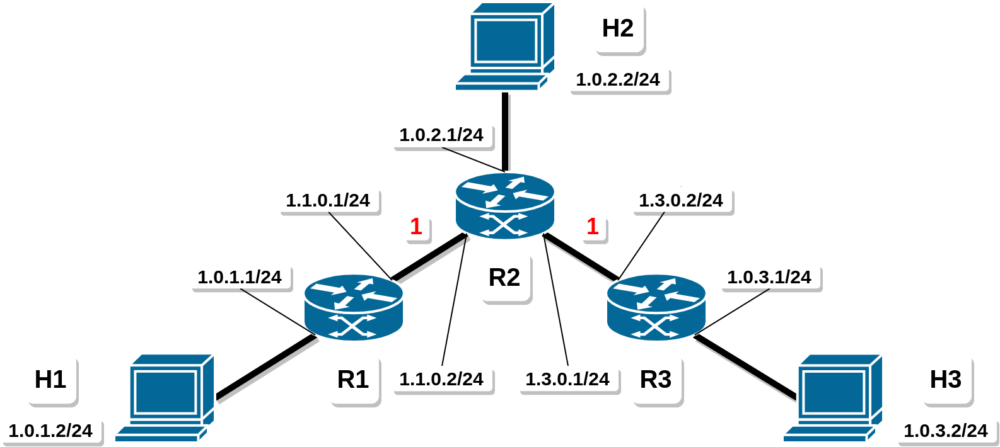

# FRRouting Manual Topology Setup




## Introduction

This simple topology is used to test *FRRouting* OSPF convergence time without any *Mininet* framework. Notice that the IPs (**black**) and the OSPF weigths (**red**) are shown in the figure above. Indeed, everything runs in *Linux Network Namespaces* linked together by *veth* interfaces.


## Execution

The scenario can be executed using the follwing command:

```bash
./run_topo.sh
```

The aforementioned script will build the network, enable tcpdump on every interface (`.pcap` files will be available in the `./pcap` directory) and start pinging from `H1` to `H3`. One should see that that connectivity is established after a while because of OSPF convergence time. One can stop the execution of the script using CTRL+C.

> **Attention!**  
> Stopping the `./run_topo.sh` will not delete the namespaces or stop the running programs.

One can also check the connectivity among all the hosts by executing the following command:

```bash
./ping.sh
```

Finally, to stop every running program and delete all the network namespaces, please execute:

```bash
./clean_topo.sh
```
