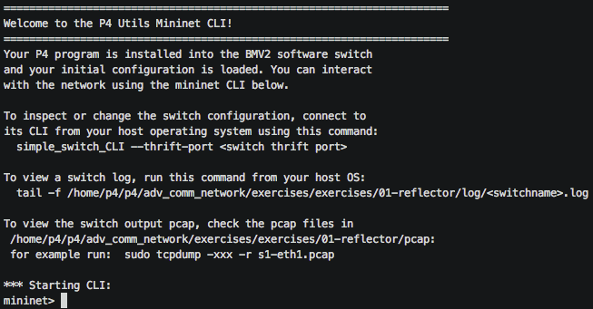
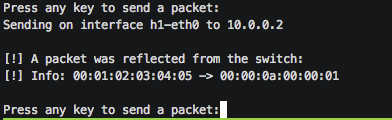

# Packet Reflector

## Introduction

The packet reflector will be our very first P4 exercise. The main objective
of this exercise is to show you how to create simple topologies with hosts and
p4 switches and how to add links between them. Then you will implement
a very simple p4 program that makes switches bouncing back packets to the interface
the packets came from.

## First Steps

Since this is a first contact with the environment, we will provide some files that will help you solving the exercise:
- `p4app.json`: describes the topology we want to create with the help of *Mininet* and the *P4-Utils* package.
- `network.py`: a Python scripts that initializes the topology using *Mininet* and *P4-Utils*. One can use indifferently `network.py` or `p4app.json` to start the network.
- `send_receive.py`: script to send and receive packets.
- `reflector.p4`: p4 program skeleton to use as a starting point.

The provided files are enough to start a topology with one host and
one switch connected between each other. However, since the p4 program
contains an incomplete program, the switch will just drop the packets we
send to it.

Follow these instructions to create a mininet network and run `reflector.p4`:

1. To create the topology described in `p4app.json`, you just have to call `p4run`, which by default will check if the file `p4app.json` exists in the path:
   ```bash
   sudo p4run
   ```

   This will call a python script that parses the configuration file, creates
   a virtual network of hosts and p4 switches using mininet, compile the p4 program and load it in the switch. You can find the *P4-Utils* documentation [here](https://nsg-ethz.github.io/p4-utils/index.html).  

   Otherwise, one can simply execute the Python script provided:
   ```bash
   sudo python network.py
   ```

   After running the network with one of the two aforementioned methods, you will get the `mininet` CLI prompt (you can find some documentation about the CLI [here](https://github.com/nsg-ethz/p4-learning/wiki/Control-Plane)):

   

2. At this point you will have a small topology that consists of a host `h1` and a p4 switch `s1`. You can get a terminal in `h1` by either
typing `xterm h1` in the CLI, or by using the `mx` command that comes already installed in the VM:
   ```bash
   mx h1
   ```

3. From the `h1` terminal you can run `send_receive.py`, a small python script that sends packets to the switch
and prints if the packets get reflected. Since the switch with the initial code in `reflector.p4` is not doing anything, all the packets it receives will get dropped and
nothing will get reflected back to `h1`.

4. Close all the host-terminals and type `quit` to leave the mininet CLI and clean the network.
   ```
   mininet> quit
   ```

   > Alternatives: `exit` or Ctrl-D

So far we have seen how to start the network and send packets to the switch. Now you have all the pieces to start
writing your first p4 program and load it into the switch.

#### Note about the CLI

You can load a new program into the switch without restarting the entire topology using the reboot command:

```
mininiet> p4switch_reboot s1
```

Just rebooting switches is very helpful since you will be able to keep all the host terminals you opened. Check the p4-utils CLI for more
information.

## Implementing the Packet Reflector

To solve this exercise, you only need to fill the gaps in the
`reflector.p4` skeleton. The places where you are supposed to write your own code
are marked with a `TODO`.

In the end, your program should do the following:

1. Parse the `ethernet` header and make a transition to `MyIngress`.
Note that the definition of the `ethernet` header and the `headers` struct is already defined for you.

2. Swap the packet's ethernet addresses. You can use an action or simply write the code directly
   in the control `apply`.
   >Hint: you can define and use local variables to swap the addresses: `bit<48> tmpAddr`;

3. Use the *ingress_port* as *egress_port*. The value of the `ingress_port` will be stored in the packet
metadata, in the variable `standard_metadata.ingress_port`. To set a packet's output port, you need to set
`standard_metadata.egress_spec` metadata field. For more information about the standard metadata fields read: [simple switch documentation](https://github.com/nsg-ethz/p4-learning/wiki/BMv2-Simple-Switch#standard-metadata).

4. Deparse the `ethernet` header.

> Note: The use of tables is possible but not strictly necessary for completing this exercise.

## Testing your solution

If you finished the 4 steps above you can repeat the steps explained in `First Steps` section. This time when you send a packet
you should get a reflected packet from the switch with the MAC addresses swapped:



If you get the same output you can move to the next exercise, but first clean the network.
