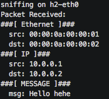

# Repeater

## Introduction

In the second introductory exercise we will use our first table and conditional
statements in a control block. In this exercise you will make a two-port
switch act as a packet repeater, in other words, when a packet enters `port 1`
it has to be leave from `port 2` and vice versa.

<p align="center">

<p/>

## Before Starting

As we already did in the previous exercise we provide you some files that will
help you through the exercise.

- `p4app.json`: describes the topology we want to create with the help of *Mininet* and the *P4-Utils* package.
- `network.py`: a Python scripts that initializes the topology using *Mininet* and *P4-Utils*. One can use indifferently `network.py` or `p4app.json` to start the network.
- `send.py`: script to send packets.
- `receive.py`: script to receive packets.
- `repeater.p4`: p4 program skeleton to use as a starting point.

Again all these files are enough to start the topology. However packets will
not flow through the switch until you complete the p4 code.

To test if your repeater works you can use `send.py` and `receive.py`. Send just sends a single
packet to the destination address you pass as a parameter. Receive prints the content of each
received packet.

#### Note about p4app.json

If you have a look at the `p4app.json` file we provide you, at the bottom you can find
the description of the topology used in this exercise:

```json
"topology": {
    "assignment_strategy": "l2",
    "links": [
        ["h1", "s1"],
        ["h2", "s1"]
    ],
    "hosts": {
        "h1": {},
        "h2": {}
    },
    "switches": {
        "s1": {}
    }
}
```

The topology object describes hosts, switches and how they are connected.
In order to assist us even further when creating a topology an `assignment_strategy`
can be chosen. For this exercise we decided to use `l2`. This means that all the devices composing
the topology are assumed to belong to the same subnetwork. Therefore hosts get automatically assigned
with IPs belonging to the same subnet (starting from `10.0.0.1/16`). Furthermore, and unless disabled,
*P4-Utils* will automatically populate each host's ARP table with the MAC addresses of all the other hosts.

For example, after starting the topology, `h1` arp table is already loaded with h2's MAC address:


> Automatically populating the ARP Table is needed because our switches do
> not know how to broadcast packets something strictly needed during the Address Resolution.

You can find all the documentation about `p4app.json` in the *P4-Utils* [documentation](https://nsg-ethz.github.io/p4-utils/usage.html#json).

## Implementing the Packet Repeater

To solve this exercise you only need to fill the gaps you will find in the
`repeater.p4` skeleton. The places where you are supposed to write your own code
are marked with a `TODO`. You will have to solve this exercise using two
different approaches (for the sake of learning). First, and since the switch
only has 2 ports you will have to solve the exercise by just using conditional statements
and fixed logic. For the second solution, you will have to use a match-action table and
populate it using the CLI.

### Using Conditional Statements

1. Using conditional statements, write (in the `MyIngress` Control Block) the logic
needed to make the switch act as a repeater. (only `TODO 3`)

### Using a Table

> If for the second solution you want to use a different program name and
> and topology file you can just define a new `p4` file and a different `.json`
> topology configuration, then you can run `sudo p4run --config <json file name>`.

1. Define a table of size 2, that matches packet's ingress_port and uses that
to figure out which output port needs to be used (following the definition of repeater).

2. Define the action that will be called from the table. This action needs to set the output port. The
type of `ingress_port` is `bit<9>`. For more info about the `standard_metadata` fields see:
the [`v1model.p4`](https://github.com/p4lang/p4c/blob/master/p4include/v1model.p4) interface.

3. Call (by using `apply`), the table you defined above.

4. Populate the table (using the Thrift client command file `s1-commands.txt`). For more information
about table population check the following [documentation](https://github.com/nsg-ethz/p4-learning/wiki/Control-Plane), [documentation 2](https://nsg-ethz.github.io/p4-utils/usage.html#control-plane-configuration), [advanced docs](https://nsg-ethz.github.io/p4-utils/advanced_usage.html#control-plane-configuration).

## Testing your solution

Once you have the `repeater.p4` program finished you can test its behaviour:

1. Start the topology (this will also compile and load the program) using
   ```bash
   sudo p4run
   ```
   or
   ```bash
   sudo python network.py
   ```

2. Get a terminal in `h1` and `h2` using `mx`:

   ```bash
   mx h1
   mx h2 #in different terminal windows
   ```

   Or directly from the mininet prompt using `xterm`:

   ```
   mininet> xterm h1 h2
   ```

3. Run `receive.py` app in `h2`.

4. Run `send.py` in `h1`:

   ```bash
   python send.py 10.0.0.2 "Hello H2"
   ```

   The output at `h2` should be:

   

5. Since the switch will always forward traffic from `h1` to `h2` and vice versa, we can test
the repeater with other applications such as: `ping`, `iperf`, etc. The mininet CLI provides some helpers
that make very easy such kind of tests:

   ```
   mininet> h1 ping h2
   ```

   ```
   mininet> iperf h1 h2
   ```

#### Some notes on debugging and troubleshooting

You should not have had any trouble with these first introductory exercises. However, as things get
more complicated you will most likely need to debug your programs and the behaviour of the switch and network.

We have added a [small guideline](https://github.com/nsg-ethz/p4-learning/wiki/Debugging-and-Troubleshooting) in the documentation section. Use it as a reference when things do not work as
expected.
