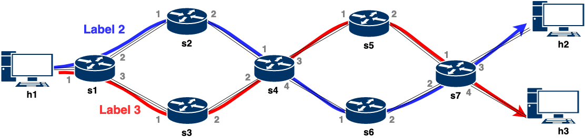
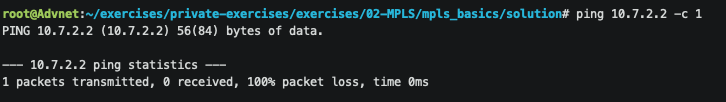

# Multiprotocol Label Switching (MPLS)

In this exercise you will see a different forwarding technique: Multiprotocol Label Switching. Your final objective will be to implement a basic version of MPLS forwarding in the data plane.

MPLS attaches labels to data packets to drive the packet forwarding decisions. That is, instead of forwarding packets based on their IP addresses, switches forward packets just by looking up the contents of the MPLS labels that are attached to packets.

As you will see, MPLS has numerous benefits such as the possibility of creating end-to-end circuits for all types of packets or an extensive support for traffic engineering.

### MPLS Terminology

Before we begin, we need some vocabulary to understand the concepts better:

- Multiprotocol Label Switching (MPLS): A highly scalable, data-carrying mechanism that is independent of any data link layer protocol.
- Label Edge Router (LER): A router that operates at the edges of an MPLS network. An LER determines and applies the appropriate labels and forwards the labeled packets into the MPLS domain.
- Label Switch Router (LSR): A router that switches the labels that are used to route packets through an MPLS network. You can understand LSRs as *all* the MPLS-capable switches in the network. LERs are also LSRs.
- Label Switched Path (LSP): A route through an MPLS network, defined by a signaling protocol such as the Border Gateway Protocol (BGP). The path is set up based on criteria in the forwarding equivalence class (FEC).
- Forwarding Equivalence Class (FEC): A set of packets with similar characteristics that might be bound to the same MPLS label. **An FEC tends to correspond to a label switched path (LSP); however, an LSP might be used for multiple FECs.**

### MPLS Label Encoding

In actual MPLS, the label stack is represented as a sequence of *label-stack entries*. Each label-stack entry is represented by 4 bytes:

```bash
Label: Label Value, 20 bits
Exp: Experimental Use, 3 bits
S: Bottom of Stack, 1 bit
TTL: Time to Live, 8 bits
```

The meaning and usage of each field is as follows:

> Label Value: This 20-bit field carries the actual value of the label. When a labeled packet is received, the label value at the top of the stack is looked up. As a result of a successful lookup one learns:
>  * the next hop to which the packet is to be forwarded
>  * the operation to be performed on the label stack before forwarding; this operation may be to replace the top label stack entry with another, or to pop an entry off the label stack, or to replace the top label stack entry and then to push one or more additional entries on the label stack.

> Experimental Use: This three-bit field is reserved for experimental use.

> Bottom of Stack (S): This bit is set to one for the last entry in the label stack (i.e., for the bottom of the stack), and zero for all other label stack entries.

> Time to Live (TTL): This eight-bit field is used to encode a time-to-live value.

The label-stack entries appear **_after_** the data-link layer headers, but **_before_** any network layer headers. The top of the label stack appears **_earliest_** in the packet, and the bottom appears **_latest_**. The network-layer packet immediately follows the label-stack entry which has the `S` bit set.

</br>

## 1. Introduction to MPLS

 As a packet travels from one router to the next, each router makes an independent forwarding decision for that packet. Choosing the next hop can be thought of as the composition of two functions. The first function partitions the entire set of possible packets into a set of "Forwarding Equivalence Classes (FECs)". The second maps each FEC to a next hop. Insofar, as the forwarding decision is concerned, different packets which get mapped into the same FEC are indistinguishable.

In MPLS, the assignment of an arbitrary packet to a specific FEC is done just once: as the packets enter the MPLS network. The FEC to which the packet is assigned is encoded as a short fixed length value known as a `label`. When a packet is forwarded to its next hop, the label is sent along with it; that is, the packets are "labeled" before they are forwarded into the network.

In the MPLS forwarding paradigm, once a packet is assigned to a FEC, no further header analysis is done by subsequent routers; all forwarding is driven by the labels.

MPLS mainly relies on three features:

1) A Match-Action Table that maps classes of packets into the desired labels (i.e., FTN).
2) Labels that are carried by the packets.
3) A Match-Action Table that maps labels to egress ports to execute the forwarding (i.e., the NHLFE).

>The **FEC-to-NHLFE Map (FTN)** points each FEC to a NHLFE (or a set of NHLFEs when Traffic Engineering is applied). It is used when forwarding packets that arrive unlabeled, yet to be labeled before being forwarded.

>A **label** is a short, fixed-length, locally significant identifier which is used to identify a FEC. It is the responsibility of each Label Switching Router (LSR) to ensure that it can uniquely interpret its incoming labels.

>**Next Hop Label Forwarding Entry (NHLFE)** is used when forwarding a labeled packet. It contains information about the packet's next hop.

</br>

## Exercise: Implementing the MPLS Basics

 In this first section of the exercise, your task will be to implement a mock MPLS architecture. In this mock architecture, we will have a single label for each packet. These labels will be imposed by the ingress LER and they will hold a global meaning. In short, this mock MPLS architecture encodes FECs into labels.

### Before starting

As we do in order exercises, we provide you some files that will
help you through the exercise.

- `p4app.json`: describes the topology that you will use throughout the exercise.
- `network.py`: a Python scripts that initializes the topology using *Mininet* and *P4-Utils*. One can use indifferently `network.py` or `p4app.json` to start the network.
- `p4src/basics.p4`: contains the p4 program skeleton that you will use as a starting point for this first section of the exercise (mock MPLS).
- `p4src/stacked.p4`: contains the p4 program skeleton that you will use as a starting point for the second section of the exercise (realistic MPLS).

**Note**: This time you will not be able to run `p4run` until you finish some of the `TODOs`.

In this exercise, you will work with the following topology. Your objective is to enable communication from h1 to h2 and h3, by implementing different functionalities of MPLS.

<p align="center">

<p/>

### Task 1. Adding MPLS-label support

1. Create a new `etherType` to indicate the MPLS protocol. LERs will use this `etherType` to detect MPLS packets. Just as `TYPE_IPv4`, `TYPE_MPLS` will have a size of 16 bits. You can pick the value that you want. If you want to follow the standard use `0x8847`.

2. Create a header type for the MPLS label. The header should have 4 fields as described [above](#mpls-label-encoding). Each layer in the header stack should have a 20-bit field called `label`, a 3-bit field called `exp`, a 1-bit field called `s` (bottom-of-stack), and an 8-bit field called `ttl`.

3. Instantiate the struct `headers` including the MPLS header that you have just created. Note that the MPLS header will go in between the IPv4 header and the Ethernet header.

4. Create a parser, `parse_mpls`, that extracts the MPLS header whenever an MPLS packet is received.

5. Call the parser in case an MPLS packet is detected. You can use the constant `TYPE_MPLS` that you have created to know if the Ethernet packet contains an MPLS header, or just the IPv4.

### Task 2. Setting packet labels from ingress switches (s1)

Implement the functionality that allows the entry switch (s1) to add an extra header in the packet that will be used as label across the path.

First, you need to identify packets accessing the MPLS network. To that end:

1. Note that we have created two metadata fields `is_ingress_border` and `is_egress_border`, that will help us identify the packets that are processed from an **ingress switch** (i.e., the switch through which the packet **accesses the MPLS network**) and from an **egress switch** (i.e., the switch through which the packet **leaves the MPLS network**).

2. Create a new table `check_is_ingress_border` that checks if the ingress port of the packet corresponds to an entry of the MPLS network. The table should (exact-) match on the `standard_metadata.ingress_port`, and should execute the action `set_is_ingress_border` in case it is hit.

3. Create the action `set_is_ingress_border` that sets the `is_ingress_border` metadata field to 1 whenever executed.

4. If you take a look at `s1-commands.txt`, you can see how we have already filled the `check_is_ingress_border` table entries for you. In this case (switch s1), all packets entering from port 1 (i.e., coming from h1) will hit the entry, and therefore will be identified.

```
table_add check_is_ingress_border set_is_ingress_border 1 =>
```

Switch s1 will have to act as an ingress_border switch for those packets, and add an MPLS header to them, selecting the best label according to their forwarding equivalency class (FEC). Implementing this functionality will be your next task.

We already give you the code for the ingress pipeline. Take a look at it and make sure you understand the logic.
```
apply {

  // We check whether it is an ingress border port
  check_is_ingress_border.apply();

  if(meta.is_ingress_border == 1){

      // We need to check whether the header is valid (as mpls label is based on dst ip)
      if(hdr.ipv4.isValid()){

          // We add the label based on the destination
          fec_to_label.apply();
      }
  }
```

As you can see, the code just checks whether the switch should act as an ingress switch and, in case it should, the table `fec_to_label` is applied. This table will be responsible for selecting, and adding, the MPLS label to the packet.

**Which MPLS label will we add?** We want to create two forwarding equivalency classes (FECs): one for packets destined to h2 (10.7.2.2), and one for packets destined to h3 (10.7.3.2). In order to do that:

5. Create the `fec_to_label` table. It should (lpm-) match on the `hdr.ipv4.dstAddr`, and should execute an action `add_mpls_header` in case it is hit, passing as parameter the label corresponding to the FEC to which it has matched. You should use two different label values to identify packets for each of the two FECs.

6. Modify `s1-commands.txt` to include the two paths. If you used labels 2 and 3, you could fill it as follows:

```
table_add fec_to_label add_mpls_header 10.7.2.2/32 => 2
table_add fec_to_label add_mpls_header 10.7.3.2/32 => 3
```

7. At this point the ingress switch knows how to add MPLS labels based on the destination IP. However, it still does not know to which port to send packets. Let's add that functionality!

### Task 3. Forwarding packets based on labels

Implement the functionality that allows switches to (i) read the label from the packet header, and (ii) use it to forward the packets accordingly. To that end:

1. Uncomment the last lines of the ingress pipeline. Note that the command `isValid()` is used to check whether the processed packet contains an MPLS header. If that is the case, then the label is read and the packet is forwarded accordingly.

```
// We select the egress port based on the mpls label
if(hdr.mpls.isValid()){
    mpls_tbl.apply();
}
```

2. Create the `mpls_tbl` table, that (exact-) matches on the label field in the `mpls` header, and calls the action `mpls_forward` which sets the mac addresses and egress port accordingly. We already give you the action, and the table entries for `s1` as example. Note that `mac` addresses between switches do not really matter since they are not checked, but when the packet is sent to a real host, the `mac` has to match. If that is not the case, packets will be dropped and not reach the application layer of e.g., `ping` or `iperf`.

```
table_add mpls_tbl mpls_forward 2 => 00:00:00:02:01:00 2
table_add mpls_tbl mpls_forward 3 => 00:00:00:03:01:00 3
```

3. Fill up the corresponding `sx-commands.txt` entries for the other switches in the path. Your objective is that packets follow the paths indicated in the topology figure. FEC corresponding to packets destined to h2 should follow the blue path, while packets destined to h3 should follow the red path.

4. To be able to ping between `h2` and `h3` we need to add normal `ipv4` forwarding capabilities to the switches. For that, create an `ipv4_lpm` table that matches on `ipv4.dstAddr` (with an lpm match), and calls the action `ipv4_forward`. Finally, uncomment the lines of code that execute this table from the `apply` function in the ingress pipeline (look for TODO 3.4).

5. Create the `ipv4_forward` action that is called when using the normal `ipv4` forwarding. The action takes as parameter a destination mac address and an egress port. In this action, set the src ethernet address as the previous destination (mac swap), and use the action parameter to set the new destination ethernet address. Set the egress port, and decrease the TTL.

6. As you modified the TTL of the IP header, and the IP header has a checksum field, it needs to be recomputed. Since this is the first time you have to compute a checksum, we already provide you the implementation. You just have to uncomment the code and understand what it does.

7. Use `tcpdump` or the pcap log files at the output of each switch to verify that your forwarding behavior works as expected. To this point, your packets should be arriving to `s7`. 

### Task 4. Removing packet labels from egress switches (s7)

Extend the functionality that allows the last switch (`s7`) to remove the packet header once the forwarding has been decided, deparse the packet, and forward.

1. In the same way that you have been able to identify switches that should act as ingress to the MPLS network, now you have to identify egress switches. Create a table `check_is_egress_border` that (exact-) matches on the `standard_metadata.egress_port` and executes the action `is_egress_border()` if it is hit. Note that you can only obtain the egress_port to which the packet is going to be forwarded from the egress pipeline, as it is the traffic manager that executes the forwarding decision.

2. Take a look at what the action `is_egress_border()` is doing.

```
action is_egress_border(){
    hdr.mpls.setInvalid();
    hdr.ethernet.etherType = TYPE_IPV4;
    hdr.ipv4.ttl = hdr.ipv4.ttl - 1;
}
```

As you might have guessed, it is removing the MPLS header. In p4, a header is removed is by setting it to invalid with the command `setInvalid()`. When the packet is deparsed, the deparser will see that the header is not valid and it will not emit it. Also note the importance of setting the EtherType back to `TYPE_IPV4`, so that future routers outside the MPLS network can correctly parse the packets. At this point, the packet exiting the MPLS network should be exactly the same as the one which entered it (i.e., all the packet processing executed by the MPLS network is completely transparent from the outside).

3. Fill up the table entries in `s7-commands.txt`.

4. At this point you should already be able to send ping requests from h1 to h2 and h3. You can run `tcpdump` from each of the two receiving hosts to see the result: (`tcpdump -enn -l -i <interface_name>`)

From h1:
<p align="center">

<p/>

From h2:
<p align="center">

<p/>

Although the ping request is arriving to both h2 and h3, their respective ping responses are still not getting back to h1.

### Task 5. Enabling bidirectional communication

It is your task now to modify your existing solution such that the ping responses from h2 and h3 get back to h1. To this end:

1. First, let replies from both h2 and h3 follow the blue path: `s7->s6->s4->s2->s1->h1`. To do that, create a FEC for all packets with destination h1 (10.1.1.2). You can use a new label (e.g., 1) to represent such traffic along all the switches. Note that you do not need to change anything from the p4-code itself. The only thing you have to do is to add more table entries in the `sx-commands.txt` files. Don't forget to also configure s7 as ingress border switch, for packets coming from ingress ports 3 and 4, and s1 as egress border switch for packets exiting from egress 1. Please, note that `sx-commands.txt` are only read when the switches are initialized. Therefore, to update your switch table entries you can either rerun the network again, or you can type `p4switches_reboot` in the mininet `cli`.

2. Test that your solution is working by "pinging" h2 and h3 from h1. You should see the responses arriving correctly back to h1, and a 0% of packet loss, as shown in the picture below. Feel free to do some further test your implementation with other tools such as `iperf`. You can find more details about `iperf` [here](https://iperf.fr/iperf-doc.php). If you implemented the `ipv4_lpm` that allows `h2` to talk with `h3` you can test your solution with `pingall` which will test if every host can ping all the others.

<p align="center">

<p/>

3. (Optional) Now, make each ping response follow the same circuit as their corresponding ping request. In order to achieve that, you will need to separate both types of traffic in two different FECs. Note that now, matching on the `hdr.ipv4.dstAddr` will not be enough to distinguish the two FECs. *Hint: What about using both `hdr.ipv4.srcAddr` and `hdr.ipv4.dstAddr`?*

</br>

## 2. Introduction to MPLS Label Stacking

 So far, we have implemented a mock version of MPLS, where packets carry just a single (global) label that is supposed to be uniquely interpretable by all switches in the MPLS domain. However, in real MPLS, switches may interpret labels locally.

These locally-interpreted labels are known by the LERs of the MPLS network. Whenever a new packet enters the MPLS network, the corresponding ingress LER attaches `all` packet labels that are to be used by the switches along the LSP. These labels are organized as a header stack, such that each label represents a different layer in the stack. Switches along the path read their corresponding label value, select how to forward the packet based on the label, and remove (pop) it from the stack. The same is repeated until the packet reaches the penultimate LSR, which forwards the packet based on the label for the last time, and removes this last label from the stack. Note that, the egress LER then receives a normal IPv4 packet, and forwards it based on IPv4 destination address.

To illustrate the benefits of using local labels across switches instead of a global label, consider the switch `s4` in our topology.

* To follow the **global-labels strategy**, `s4` would need to identify all possible circuits in the topology. In particular, it would require 4 different labels (`dark blue`, `light blue`, `red`, and `orange`) for each of the two possible directions: `s1 to s7` and `s7 to s1`. This makes 8 labels in total. As you can assess, the number of possible circuits grows drastically with the topology size, and so does the number of global labels required. This makes global labels unfavorable from a scalability perspective.

* With a **local-labels strategy**, `s4` only needs to support labels for its possible forwarding options. For this particular topology, this is only 4 labels (i.e., one different label for each of the 4 ports). Instead of carrying information of the whole (end-to-end) path, the label corresponding to `s4` will only carry information about how the packet should be forwarded within that switch.

As you might already realize, MPLS Label Stacking is not all roses either. Building a header stack requires the ingress LER to have complete forwarding information of the entire topology just as in the global, single label version. Moreover, the size of the resulting MPLS header stack grows linearly with the number of hops in a specific path. On the bright side though, the range of labels are limited by the possible forwarding options at each switch, resulting in small MPLS forwarding tables.

<p align="center">

<p/>

</br>

## Exercise: Implementing MPLS Label Stacking
 In this second section of the exercise, your task will be to implement a more advanced MPLS architecture that enables the label-stacking functionality in the data plane. In particular, you need to design a P4 program in which:

**Ingress border switches:**
* Identify traffic based on Forwarding Equivalency Classes (FECs) that correspond to `h1`, `h2` and `h3`.
* Create MPLS header stacks and attach them to packets that are directed to these destinations.
* Forward the packets based on the uppermost label in the stack.

**Non-LER switches:**
* Identify MPLS packets and extract the MPLS labels from the uppermost layer of the stack.
* Forward packets based on the information contained in that label, and pop the uppermost layer before forwarding.

**Penultimate switches:**
* Identify MPLS packets and extract the MPLS labels from the uppermost layer of the stack.
* Forward packets based on the information contained in that label.
* Pop the uppermost (and last) layer in the stack.
* Set the `etherType` back to IPv4 before forwarding the packet.

**Egress border switches:**
* Forward the packet solely based on IPv4 principles.

### Task 1. Add MPLS Label Stacking support:

1. Create a new etherType for the MPLS protocol, `TYPE_MPLS`, which will be used to identify the protocol from the ethernet header. You can copy the one you implemented in the previous section. Use the same than in the previous exercise.

2. Define the `mpls_t` header. You can copy the header you defined in the previous exercise.

3. Note that now we do not have the `is_ingress_border` nor `is_egress_border` metadata fields. As we now have the bottom of stack `s` header field, switches can detect whether they are the last hop of an MPLS network.

4. Add the newly-defined `mpls_t[CONST_MAX_MPLS_HOPS]` header to the struct `headers`. Note how `[CONST_MAX_MPLS_HOPS]` is used to represent a header stack. This data structure will hold an array of mpls headers which you will be able to access by using an array index. However, for this exercise we will only use the top of the stack mpls header.

5. Call the MPLS parser in case the etherType `TYPE_MPLS` is detected. As you did in the previous exercise.

6. Create a parser that extracts all the layers of the MPLS header stack. As you have seen in previous exercises, in order to parse packet bytes from the wire and transfer them to actual headers we do something like `packet.extract(hdr.ethernet)`. This copies the data to the `ethernet` header. When parsing header stacks this is done a bit differently. For example: `packet.extract(hdr.mpls.next)`. The `next` keyword will allow you to use extract bytes on the `hdr.mpls` field multiple times and store them in the next array position. When you want to use one of the fields you just parsed, for example to make a parser state transition you can use `transition select(hdr.mpls.last.s)`. This will perform a select on the last mpls header you parsed. Finally, transition to `parse_ipv4` with the detection of the bottom of stack flag in a layer. To parse the entire MPLS stack your parser logic needs to call itself until a bottom of stack is found.

7. Before proceeding, please understand the ingress control block, `FEC_tbl`, and `mpls_tbl`. They are already fully provided and they shed light on the TODO assignments for the rest of this section. The first table `FEC_tbl` is basically used for ingress and egress switches (depending on the action matched). The second table `mpls_tbl`, which is only applied if the packet carries an MPLS header, is used to forward the packets using the MPLS labels, the table has two 
actions: 1) normal mpls forwarding, 2) penultimate mpls forwarding which makes sure the packet type is set to `ipv4`.

### Task 2. Complete the remaining actions:

1. Let's start analyzing our ingress control block. The block starts with a condition: `if(hdr.ipv4.isValid() && hdr.mpls[0].isInvalid())`. This condition occurs only when there is an IPv4 packet arriving to the switch.
This happens in two cases: either the switch is an ingress MPLS switch, or the egress MPLS switch. If we go to the `FEC_tbl` definition, there are two types of actions involved: `ipv4_forward` and `mpls_ingress_1_hop`. Analyze the `mpls_ingress_1_hop` action, then implement `mpls_ingress_2_hop`, `mpls_ingress_3_hop`, `mpls_ingress_4_hop`, `mpls_ingress_5_hop` yourself, so that the code can also support topologies of different path sizes.

Hint: implementing `mpls_ingress_x_hop` can be done by just carefully replicating the content of `mpls_ingress_1_hop`. You just need to use
`hdr.mpls.push_front(1)` multiple times, and set the bottom of stack accordingly (only once). Be careful with the order in which you push the mpls
headers, the last header you push in front will be the first one in the header stack. For example, if you push label1, label2, and label3, label3
will be the first one in the header stack, while label1 should be the last one. 

2. Understand what `mpls_tbl` does. Complete the `mpls_forward` and `penultimate` actions. 

    1. In `mpls_forward`, you need to:
         * Set the egress port,
         * Update packet's mac addresses accordingly (as a layer 3 router would do),
         * Decrease the TTL of the first mpls header and copy it to the second one (you can access the current header with `hdr.mpls[0]` and the next one with `hdr.mpls[1]`),
         * Finally, pop one header from the front.

    2. In `penultimate`, you need to:
         * Transform the packet back to `IPV4`. For that change the ethernet `ethertype`, update the mac addresses accordingly (as a layer 3 router would do),
         * Set the `ipv4` ttl to the one from the last mpls header - 1,
         * Finally, set the egress port and pop the last mpls header.

### Task 3. Enable communication between h1, h2, and h3:

After having completed the data plane programming, you now should fill in the table entries in `sx-commands.txt` for your network to work. Same as in the previous section, you will find 7 different command files, one for each switch in the topology. In these, we already provide the necessary entries for the `h1 -> h2` connection. Your task is to: (i) understand the provided entries, and (ii) complete the command files with the required table entries such that bidirectional communication between any two hosts in the topology is possible.

1. Complete the `sx-commands.txt` files.

### Task 4. Test your solution:

1. Use the `pingall` command from Mininet to verify whether you have connectivity between `h1`, `h2`, and `h3`.

### Task 5. (Optional) Bonus:

1. Create your own topology with different hosts located at a different number of hops from each other. Tinker with your solution.

