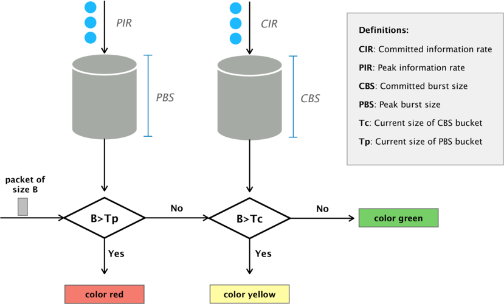

# Traffic Engineering with RSVP (I)

> **IMPORTANT:** This exercise builds upon the [MPLS Stacked](../../04-MPLS/thrift/mpls_stacked).
> Make sure that your MPLS stacked implementation works before
> continuing.

In this exercise, we will extend your MPLS (stacked) implementation with RSVP
capabilities.

## Introduction to (Simplified) RSVP

The Resource Reservation Protocol (RSVP) allows a sender to reserve resources
(e.g., bandwidth) through a network to a destination. If the reservation is
granted -- that is, all the routers in the path allocate the requested bandwidth
to the flow --, the sender can send traffic at the requested rate and no other
flow can occupy this bandwidth.

For the exercise, we will implement a simplified and customized version
with the following properties:

- A source host S reserves resources for a unidirectional flow (identified by
  source and destination IP address) to a destination D by contacting a central
  controller C.
- The reservation (`Resv`) message contains the following attributes:
  - `src`: the IP address of the source
  - `dst`: the IP address of the destination
  - `bw`: the requested bandwidth (in megabits per second)
  - `t`: the duration of the flow (in seconds)
  - `p`: the priority of the reservation (the higher, the better)
- Reservations are "sent" to the central controller through a CLI interface.
- Reservations automatically expire after the timeout.
- The controller grants reservations, configures switches and removes
  reservations after the timeout. Forwarding packets of the flow happens in the
  data plane without involving the controller (using MPLS).
- Without a (granted) reservation, it is not possible to send traffic through
  the network. Therefore, to send traffic from S to D and back from D to S, two
  reservations are required (one for each direction). The only exception is when
  S and D are connected to the same switch. Then, communication is possible
  without a reservation.
- The controller has access to all switches and can modify their configuration
  (including match-action table entries).

## Before Starting

We provide you some files that will help you
through the exercise.

Amongst others, you will get these files:
- `p4app.json`: describes the topology that you will use throughout the exercise. See the figure below. We also added `p4app-simple.json` topology in case you want to use a smaller (triangle) topology.
- `network.py`: a Python scripts that initializes the topology using *Mininet* and *P4-Utils*. One can use indifferently `network.py` or `p4app.json` to start the network.
- `rsvp_controller.py`: skeleton for the controller (your task will be to implement the missing pieces).
- `cli.py`: CLI to interact with the controller (already implemented).

Note that we do not provide a P4 template this time because you will re-use the code from the previous (MPLS stacked) exercise. Therefore, copy this code to
`rsvp.p4` (if you did not finish the MPLS exercise, continue with it today):

### Network Topology

For this exercise, we provide you with a sample configuration for the topology
shown below. However, feel free to test your solution with your own topologies
too. For example, you can use a very small topology with 2-3 switches while you 
develop your solution, and once you have a working prototype move to a bigger 
topology.

<p align="center">

<p/>

The bandwidth for each link is set to 10 Mbps (see `p4app.json`).

### Control Plane

The focus of this exercise will not be on the data-plane implementation (you
will use the [MPLS stacked code](../../04-MPLS/p4runtime/mpls_stacked) with a small modification) but on the
control plane. To get started, we provide you with a code skeleton for the
controller in `rsvp_controller.py`.

The skeleton already implements the following features:
- Connections to all the switches (`self.connect_to_switches()`)
- A list of all links and their capacities (`self.build_links_capacity()`). 
- The topology as a networkx graph (`self.topo.network_graph`)
- A function to get all paths between two nodes (`self.get_sorted_paths(src, dst)`)
- A CLI (`cli.py`)

### Running the Controller

To start the controller CLI, first start your topology with `sudo p4run`, and then, simply run:
```bash
python rsvp_controller.py
```

This will start a CLI we made for the exercise where you can run a set of
different commands that will not do anything until you implement them. You can
type `help` to see the commands (`add_reservation` and `del_reservation` among
the most important ones).

### Performance Optimizations

To test the performance of our implementation we will need to send hundreds of
thousands of packets through the switch. Below, we explain how you can increase
the performance of `bmv2` to achieve higher throughput.

#### Disabling Debugging in the bmv2 Switch
As you have already seen in the previous exercises, if you do an `iperf`
between two directly connected hosts you get roughly a bandwidth of `15~20mbps`.
In order to be able to send packets fast to the switch we can clone the
repository again with a different name and compile it with different flags.
Since this process can take up to 10 minutes you can just leave it running in
the background.
```bash
cd ~/p4-tools/
git clone https://github.com/p4lang/behavioral-model.git bmv2-opt
cd bmv2-opt
git checkout 62a013a15ed2c42b1063c26331d73c2560d1e4d0
./autogen.sh
./configure --without-nanomsg --disable-elogger --disable-logging-macros 'CFLAGS=-g -O2' 'CXXFLAGS=-g -O2'
make -j 2
sudo make install
sudo ldconfig
```
**IMPORTANT:** It is recommended that you do not run the `sudo make install`
command until you have a working solution. When using this optimized compilation
the switch will not generate log files, and thus it will be hard for you to
properly debug your program. Since we keep the two compiled versions of `bmv2`
in different folders, you can enable the one with the `debugging` enabled by
just running the `make install` command again:

```bash
cd ~/p4-tools/bmv2
sudo make install
sudo ldconfig
```

Thus by running `sudo make install` in `~/p4-tools/bmv2` or
`~/p4-tools/bmv2-opt` you can easily enable each compiled version.

### Some Notes on Debugging and Troubleshooting

At this point you probably know how to debug your programs. In any case, we 
added  a [small guideline](https://github.com/nsg-ethz/p4-learning/wiki/Debugging-and-Troubleshooting)
in the documentation section. Use it as a reference when things do not work as
expected.

## Part 1: RSVP without Bandwidth Guarantees

For the first part of this two-part exercise we will implement a functional RSVP
controller. After completion of this part, we should be able to add/delete
reservations through the controller's CLI. The controller should make the
allocations taking into account `src`, `dst`, `duration` and `bw`. Thus, for
this part, `priorities` will not be used. Furthermore, although the controller
will take the reservation `bandwidth` into consideration when making the path
allocations, we will still not rate limit them in practice.

## Configure MPLS from the Controller

Before starting with RSVP, we will configure the network MPLS switches as in the
previous exercise (mpls_stacked). For this, we use the MPLS implementation from
the previous exercise with a slight modification: Instead of configuring the
switches via static entries in the `sX-commands.txt` files, the controller now
adds these entries dynamically.

### Task 1: Fix the FEC Table

As a small modification compared to the MPLS implementation, we need to
modify the structure of the `FEC_tbl` table to fix the following problem: Since
the table currently only matches on the destination IP address, switches would
forward traffic to a destination irrespective of the source address, which is
not what RSVP should do. To fix this, we also match on the source IP address and
we modify the table structure such that it looks as follows:

We will basically add `ipv4.srcAddr` to the match keys, and optionally, you can
extend the `mpls_ingress_X_hop` actions to support more hops:

```
table FEC_tbl {
    key = {
        hdr.ipv4.srcAddr: lpm;
        hdr.ipv4.dstAddr: exact;
    }
    actions = {
        ipv4_forward;
        mpls_ingress_1_hop;
        mpls_ingress_2_hop;
        mpls_ingress_3_hop;
        mpls_ingress_4_hop;
        mpls_ingress_5_hop;
        mpls_ingress_6_hop;
        mpls_ingress_7_hop;
        mpls_ingress_8_hop;
        NoAction;
    }
```

> NOTE: bmv2 allows only one `lpm` match per table and you will later see why we
do the `lpm` match on the source IP.

### Task 2: Install Rules for MPLS Forwarding

In this task, we will only configure the switches to forward traffic based on
the MPLS label and the IP addresses. Later, we will add the configurations to
push label stacks onto packets at ingress switches. In other words, we will
automatically populate the `mpls_tbl` table and `FEC_tbl` for the `ipv4_forward`
action.

Remember from the MPLS exercise that we need to add the following entries:

- For each host, we need a rule to forward traffic from the switch where it is
  connected. For example: (see we have 0.0.0.0/0 as source match). Note, that the 
  longest prefix match `0.0.0.0/0` will match to every IP.
  ```
  table_add FEC_tbl ipv4_forward 0.0.0.0/0 10.0.0.1 => 00:00:0a:00:00:01 3
  ```

- For each pair of connected switches (both directions), we need rules to
  forward traffic based on the MPLS label. Furthermore, for each entry we will
  need a duplicate for the case in which bottom of stack is `1` (in which we
  have to call `penultimate`). For example:
  ```
  table_add mpls_tbl mpls_forward 2 0 => 00:00:00:06:02:00 2
  table_add mpls_tbl penultimate 2 1 => 00:00:00:06:02:00 2
  ```

Your task is now to implement `set_mpls_tbl_labels()` in `rsvp_controller.py`
such that it adds these entries.

A few hints which will help you to solve this task:

- Assign each port of a switch one label (label `1` to port 1, label `2` to port
  2, and so on). The label stack for a path then becomes the list of the labels
  associated with the traversed switch egress ports.

- You can iterate over all switches and their respective controllers like this:
  ```python
  for sw_name, controller in self.controllers.items():
    ...
  ```

Useful methods provided by the `Topology` object that will help you in this
task:

- `self.topo.get_hosts_connected_to(sw_name)` returns all the hosts connected to
  `sw_name`.
- `self.topo.get_switches_connected_to(sw_name)` returns all the switches
  connected to `sw_name`.
- `self.topo.node_to_node_port_num(sw_name, host)` returns the port at which
  `sw_name` is connected to `host`.
- `self.topo.node_to_node_mac(switch, sw_name)` returns the MAC address of the
  interface on `switch` which is connected to `sw_name`.
- `self.topo.get_host_ip(host)` returns the IP address of `host`
- `self.topo.get_host_mac(host)` returns the MAC address of `host`
- `controller.table_add(table_name, action, [match1, match2], [action_parameter1, action_parameter2])` 
  inserts a table entry. Note that, `table_add` expects all parameters in match and action lists to be strings, 
  make sure you cast them before.

For more info about the controller topology functions see the [documentation](https://nsg-ethz.github.io/p4-utils/p4utils.utils.topology.html) and [source code](https://github.com/nsg-ethz/p4-utils/blob/master/p4utils/utils/topology.py). 

## Central RSVP Controller

In this part of the exercise, you will implement a central controller
which:

1. Receives reservation requests from hosts, checks whether a request can be
   satisfied and -- if yes -- computes a path through the network
2. Configures ingress switches to send traffic belonging to this reservation along
   the computed path using MPLS
3. Delete reservations after they time out

Below, we explain each of these steps in more detail.

### Task 3: Receive Reservations and Compute Paths

Reservations are sent to the controller through the CLI interface. For example,
the following command should add a reservation for a flow from `h1` to `h2`
lasting `10 s` with a bandwidth of `3 Mbps`:
```
rsvp-menu> add_reservation h1 h2 10 3
```

Internally, this CLI command calls the function `self.add_reservation(src='h1', dst='h2', duration=10.0, bw=3.0,  priority=1)` in `rsvp_controller.py`. For now, you can ignore the priority attribute. We will look at this in a later exercise.

A few hints which will help you to solve this task:

- Use the predefined dictionary `self.links_capacity[link]` to keep track of the
  available capacity in each link. Initially, this dictionary contains the
  default bandwidth (10 Mbps) for each link (`dict: (sw1, sw2) --> bw`). 
  This data structure will be provided to you with all the edges already in the dictionary.

- Use the predefined dictionary `self.current_reservations` to keep track of
  existing reservations. Each entry in this dictionary should have the following
  structure:
  ```python
  self.current_reservations[(src, dst)] = {
      "timeout": (duration), 
      "bw": (bandwidth), 
      "priority": (priority), 
      'handle': entry_handle, 
      'path': path
    }
  ```
  Thus, every time you need to modify or delete a reservation you will have all
  the needed information to update the controller state. For example, the
  timeout will be used by the controller to know when to clear the entry, the
  `bw` and the `path` can be used to restore links capacities. The table
  `handle` to update the current entry in the switch.

Your task is now to implement the function `add_reservation` (and its helper functions).
This function should try to allocate bandwidth reservations whenever there is 
capacity in the network, otherwise should discard them. Furthermore, it should be
to receive updated reservations for existing allocations, update its attributes, 
move them to a new path if required, or even delete them if the updated request 
can not be fulfilled anymore. We suggest you to implement `add_reservation` with
the following steps:

1. Compute a path from `src` to `dst` which has enough capacity left. 

   - Implement `self.get_available_path(src, dst, bandwidth)` to compute an
     available path and then call this function in `self.add_reservation(...)`.
     Remember that `self.get_sorted_paths(src, dst)` returns you a list of all
     paths between `src` and `dst`. The only remaining task is to select one of
     these paths which has enough capacity left. 

   - Implement `self.check_if_reservation_fits(path, bw)` to check if there is
     enough bandwidth available on all links of a given path. This function needs
     to check if all edges along the path have `bw` capacity or more. 
    
   - Iterate over the list of paths and using `check_if_reservation_fits` return the
     first path that can fit the allocation.

2. If there is a possible path, determine the required MPLS label stack. 

   - Implement `build_mpls_path(switches_path)` such that it returns the list of
     MPLS labels that make a packet following the given `switches_path`. Hint:
     `self.topo.node_to_node_port_num(current_node, next_node)` returns you the
     port at which `current_node` is connected to `next_node`. Take into account that
     your `rsvp.p4` program might add the port-labels in the reverse order, this will depend
     on your `mpls` implementation. Thus, make sure you add the labels in the right order.

3. Prepare all the variables needed to add or modify an entry to the `FEC_tbl` table 
   using action `mpls_ingress_X_hop`:

    - Get the ingress switch name (hint: using path) so we can add the table
      entry to the right switch (`self.controllers[sw_name]`).

    - Get the action name `mpls_ingress_X_hop`, where `X` is the number of
      labels.

    - Get the source and destination addresses and build a match variable using a
      list. Note that the source address needs to be specified as an lpm match
      (e.g. `10.0.1.2/32`).

    - Convert the MPLS labels path to strings and use it as action parameters.

4. Use all the variables we computed to add a table entry or modify an existing
   reservation.

    - Implement `add_link_capacity(self, path, bw)` and `sub_link_capacity(self, path, bw)`. 
      This functions, should be used to update `self.links_capacity`. `sub` is
      used when an allocation is made, `add` when an allocation is removed.

    - Check if there is an existing reservation from `src` to `dst`. If yes, we
      will later update this reservation instead of creating a new one. It is
      important that you check this at the very beginning of `add_reservation`
      before you even select the path. If there is a reservation for this (src,dst)
      already, we will undo the previous allocation and replace it with the new 
      requested bandwidth. For example, you can add the bandwidth of the previous 
      reservation with `add_link_capacity` before you search for a possible new 
      path.
    
    - If it's a new reservation (for the given `(src, dst)` pair), configure
      the ingress switch to add the MPLS stack. As in the previous exercise, it
      needs to call the action `mpls_ingress_X_hop` (where `X` is the length of
      the path) in the table `FEC_tbl`. To add a table entry from the
      controller, call 
      `self.controllers[sw_name].table_add(table_name, action, match, action_parameters)`.
      Use all the parameters you created in 3.3. If successful, `table_add` will
      return an entry handle that you should save.

    - If there is already a reservation for the same (src,dst) pair, use 
      ``self.controllers[sw_id].table_modify(table_name, action, entry_handle, action_parameters)`
      to modify it.

    - If the entry insertion or modification was successful (i.e., handle was
      returned). You will have to store all the information from the
      reservation. Use the `self.current_reservation` dictionary to store the
      timeout, bandwidth, priority (not used now), entry_handle and path (as
      shown in the hint above).

    - Update `self.links_capacity` using `self.sub_links_capacity(path, bw)`.
      Such that the reservation is taken into account by the controller.

Hint:
 - There are two `cli` functions that can be used to debug the state of the
   `link_capacities` and `current_reservations`. Use `print_reservations` and
   `print_link_capacity` to see those data structures in real time. 

### Task 4: Delete Reservations

Once you can add reservations, it is time to implement the functions to remove
them. If you look in `cli.py`, you will see two functions to delete
reservations(`del_reservation` and `del_all_reservations`).

1. Implement `del_reservation(src,dst)` in the `rsvp_controller.py`.This
   function should remove a reservation from `self.current_reservations` and
   delete the corresponding entry in the switch.

   - Check `self.current_reservations`. If there is an entry for `(src,dst)`,
     remove it using its handle. Otherwise, print an error message.
   - Update `links_capacity`.
   - Remove it from `self.current_reservations`. 

2. Implement `del_all_reservations()`. Use `self.current_reservations` to delete
   all reservations. For each reservation call `del_reservation`.

3. Add an extension to `add_reservation`. If you can not find a path were to allocate 
   the reservation print an error message. Furthermore, if the reservation was trying 
   to modify an existing one, you have to delete it. Note that `del_reservation` will 
   call `add_link_capacity`, and for this entry you already added the capacity back at
   the beginning of `add_reservation`. An easy solution would be to call `sub_link_capacity` 
   before you delete the reservation.

Again a few hints:

- Remember that `self.current_reservations[(src,dst)]['handle']` contains the
  handle of the switch table entry (which you need to delete now).
- `self.topo.get_host_gateway_name(host)` returns the name of the switch to
  which `host` is connected.
- `self.controllers[sw].table_delete(table_name, entry_handle, True)` deletes
  the entry with handle `entry_handle` from table `entry_handle` on switch `sw`.
- Do not forget to update `self.links_capacity`.

### Task 5: Automatically Delete Reservations after a Timeout

So far, we did not remove paths after the reserved duration expired. In this
task, we will change that. To do so, we need to do the following:

- Periodically check for expired reservations
- Delete the corresponding entries from the switches

In the provided controller skeleton, there is a thread
(`self.reservations_timeout_thread`) that is started when the controller is
created. Right now the thread just sleeps every `refresh_rate` and does nothing.

1. Implement the `reservations_timeout_thread` body.

    - For each reservation in `self.current_reservations`, subtract `refresh_rate` to the timeout field.
    - If the timeout value reaches 0 or less, delete the entry.

At this point, you should have a working RSVP controller!

## Testing your Solution
To test your solution, run *P4-Utils*:
```bash
sudo p4run
```

or
```bash
sudo python network.py
```

Then run the controller in a separated terminal (e.g. in two terminal
windows or tmux panes).
```bash
python rsvp_controller.py
```

Start ping in the `mininet` CLI:
```
mininet> h1 ping h6
PING 10.7.6.2 (10.7.6.2) 56(84) bytes of data.
```

You should not see any responses from `ping` yet.

Now add reservations from h1 to h6 and vice-versa in the controller CLI:
```
rsvp-menu> add_reservation h1 h6 20 5
Adding entry to lpm match table FEC_tbl
match key:           LPM-0a:01:01:02/32 EXACT-0a:07:06:02
action:              mpls_ingress_3_hop
runtime data:        00:00:03   00:00:03        00:00:04
Entry has been added with handle 16777218

Successful reservation(h1->h6): path: s1->s3->s6->s7
rsvp-menu> add_reservation h6 h1 20 5
Adding entry to lpm match table FEC_tbl
match key:           LPM-0a:07:06:02/32 EXACT-0a:01:01:02
action:              mpls_ingress_3_hop
runtime data:        00:00:01   00:00:01        00:00:02
Entry has been added with handle 16777218

Successful reservation(h6->h1): path: s7->s6->s3->s1
```

After you added these two reservations, you should see responses from `ping` during about 20 seconds:
```
64 bytes from 10.7.6.2: icmp_seq=11 ttl=59 time=12.3 ms
64 bytes from 10.7.6.2: icmp_seq=12 ttl=59 time=11.9 ms
64 bytes from 10.7.6.2: icmp_seq=13 ttl=59 time=11.0 ms
64 bytes from 10.7.6.2: icmp_seq=14 ttl=59 time=11.7 ms
64 bytes from 10.7.6.2: icmp_seq=15 ttl=59 time=11.3 ms
64 bytes from 10.7.6.2: icmp_seq=16 ttl=59 time=12.6 ms
64 bytes from 10.7.6.2: icmp_seq=17 ttl=59 time=11.3 ms
64 bytes from 10.7.6.2: icmp_seq=18 ttl=59 time=11.7 ms
```

Afterwards, `ping` stops working because the reservations expired:

```
rsvp-menu>
RSVP Deleted/Expired Reservation(h1->h6): path: s1->s3->s6->s7
RSVP Deleted/Expired Reservation(h6->h1): path: s7->s6->s3->s1
```

Instead of `ping`, you can also test with `iperf`. 

```bash
mininet> iperf h1 h6
*** Iperf: testing TCP bandwidth between h1 and h6
```

What do you observe when you reserve a small bandwidth of just 1Mbps and run
`iperf`? Can you explain the observation?

Play with adding or modifying reservations, and make sure that the flows get
allocated as you expected.

## Part 2: Rate Limiting and Priorities

At this point, you have completed a basic implementation of centralized RSVP. Congratulations! 

As you may have noticed, even though the controller takes into account the 
bandwidth hosts request when computing the reservations, edge switches do not perform
any rate limiting. In fact, a host making a 1Mbps reservation is able to get
full bandwidth. Furthermore, at this point, all the reservations are treated equally.

In this second part of the exercise, we will improve our implementation and rate
limit host reservations using meters at ingress switches. Also, by extending our 
`add_reservation` controller function, we will introduce a sense of priority to
the reservations.

### Task 1: Reservation rate limiting with meters

During the stateful data structures lecture you were taught different P4
stateful data structures. There, we showed you that direct/indirect color
`meters` can be used to rate limit traffic. 

The `bmv2` software switch implements the so-called two-rate three-color marker meters. 
You can find more details in the corresponding [RFC](https://tools.ietf.org/html/rfc2698).
The figure below shows how two-rate three-color marker meters work. In the figure we use 
the packet size as count unit, however `bmv2` supports both bytes and packet-based meters.

Two-rate three-color meters are configured using four parameters:

* CIR(committed information rate): is the rate per unit of time in bytes or packets at which the CBS bucket is filled. 
* PIR(peak information rate): is the rate per unit of time in bytes or packets at which the PBS bucket is filled. 
* CBS(committed burst size): is the size in bytes or packets of the CBS bucket. 
* PBS(peak burst size): is the size in bytes or packets of the PBS bucket. 

If we consider a byte-based meter, a packet of size `B` is colored as follows:

1. if `B > Tp` the packet is marked red.
2. if `B < Tp` and `B > Tc` the packet is marked yellow.
3. otherwise, the packet is marked green.

<p align="center">

<p/>

In this task, you will need to extend your `rsvp.p4` program such that each reservation
is metered and all non-green packets get dropped. Furthermore, you will have to extend 
your controller code such that after every reservation (addition or modification) its 
associated meter is configured properly.

> Hint: in the last lecture there are some slides in which you can find how to define and use meters. 

### Data plane tasks:

1. Whenever a meter is executed, the color is saved into a metadata field. Define that field in your metadata structure.
2. Define a direct meter at the beginning of your ingress pipeline. You can find an example in the slides and 
   some documentation in the [v1model documentation](https://github.com/p4lang/p4c/blob/master/p4include/v1model.p4).
3. Associate the direct meter with the table `FEC_tbl`. 
4. Read the meter in all the `mpls_ingress_x_hop` actions to your metadata field. 
5. Update your ingress control logic and drop all the packets for which the meter is yellow or red (not green).

At this point, you have all the P4 logic to rate limit your traffic reservations.
However, you still need to add some small modifications to your controller code such
that associated meters get configured with the desired rate.

### Control plane tasks:

1. Understand how two-rate three-color meters work. See the text above, or read the RFC. To configure
   meters using our control plane API you will have to use `meter_set_rates(meter_name, handle, rates)`.
   `meter_name` is the name you called the meter in `P4`, `handle` is the table handle for the reservation rule and 
   `rates` is a list of the form `[(CIR, CBS), (PIR, PBS)]`. *IMPORTANT:* in `bmv2` `CIR` and `PIR` are the bucket 
   filling rate per microsecond. For example, if `CIR=1` the bucket is filled at a rate of 1000000 Bytes/s (or packets). 

2. Implement the function `get_meter_rates_from_bw(self, bw, burst_size)`. This function has to return 
   `[(CIR, CBS), (PIR, PBS)]`. Use `bw` (Mbps) to compute `CIR` and `PIR` (in bytes). 
   To make it easier, in this exercise we will make the committed and peak 
   parameters the same. Also, you can set `burst_size` to default to 700000. 
   
3. Implement the function `set_direct_meter_bandwidth(self, sw_name, meter_name, handle, bw)`. This function 
   calls `get_meter_rates_from_bw` and by using the meter name, handle and rates configures
   the meter associated with a given table entry (use `meter_set_rates`). 

4. Modify your `add_reservation` function such that every time you `add` or `modify` a reservation you 
   also update its associated meter.

### Test if rate limiting works as desired

1. Start the topology and the controller.

2. Make 2 bidirectional reservations from `h1->h5` and `h2->6`. For the 
   first one use `2Mbps`, for the second one `8Mbps`.

```
======================================================================
Welcome to the RSVP CLI
======================================================================
You can now make reservations for your hosts in the network.
To add a reservation run:
add_reservation <src> <dst> <duration> <bw> <priority>

To delete a reservation run:
del_reservation <src> <dst>

rsvp-menu> add_reservation h1 h5 1000 2 1
Adding entry to lpm match table FEC_tbl
match key:           LPM-0a:01:01:02/32 EXACT-0a:07:05:02
action:              mpls_ingress_3_hop
runtime data:        00:00:03   00:00:03        00:00:04
Entry has been added with handle 2

Successful reservation(h1->h5): path: s1->s3->s6->s7
rsvp-menu> add_reservation h5 h1 1000 2 1
Adding entry to lpm match table FEC_tbl
match key:           LPM-0a:07:05:02/32 EXACT-0a:01:01:02
action:              mpls_ingress_3_hop
runtime data:        00:00:01   00:00:01        00:00:02
Entry has been added with handle 2

Successful reservation(h5->h1): path: s7->s6->s3->s1
rsvp-menu> add_reservation h2 h6 1000 8 1
Adding entry to lpm match table FEC_tbl
match key:           LPM-0a:01:02:02/32 EXACT-0a:07:06:02
action:              mpls_ingress_3_hop
runtime data:        00:00:03   00:00:03        00:00:04
Entry has been added with handle 3

Successful reservation(h2->h6): path: s1->s3->s6->s7
rsvp-menu> add_reservation h6 h2 1000 8 1
Adding entry to lpm match table FEC_tbl
match key:           LPM-0a:07:06:02/32 EXACT-0a:01:02:02
action:              mpls_ingress_3_hop
runtime data:        00:00:01   00:00:01        00:00:02
Entry has been added with handle 3

Successful reservation(h6->h2): path: s7->s6->s3->s1
rsvp-menu>
```

3. Start an iperf server in `h5, h6`:

```bash
iperf -s -p 5001
```

4. Start an iperf client at `h1, h2` and check if each reservation gets the desired bandwidth.

<p align="center">

<p/>

### Task 2: Reservation with priorities

At this point, you should have a working RSVP centralized controller. However, we 
still did not use the `priority` attribute when performing the allocations. In this task, 
you will have to modify the `add_reservation` controller function such that some reservations
have a higher priority over others. 

When a high priority reservation comes and there is no space left many different things 
could be done. For example, previous reservations can be moved to make space, reservations 
with lower priority can be deleted to make space, etc. We propose one possible implementation, 
which will then be the one we will provide as a solution. Our proposed solution is not perfect, but 
does well enough while not needing a major change to the current implementation. In any case, 
feel free to implement a different algorithm.

We propose the following algorithm:

1. if the reservation (addition or modification) fits in the current network we do the same as before.
2. if the reservation (addition or modification) does not fit in the current network:
  1. remove (`virtually`) all the reservations with a lower priority than the requested one. Hint: you don't need to remove them from switches, you can just remove its capacities. 
  2. Check if now, (without the low priority reservations) the requested reservation fits the network. 
  3. if it fits, add or modify it. Now, take all the reservations with lower priority that you `virtually` removed, and allocate them starting with the ones with the highest priority. Some will remain in the same path, some will be moved to a new path, and some, if they don't fit anymore, will be deleted. 
  4. if it does not fit, and there is an existing entry for this reservation, delete it.

> Hint: make sure `self.links_capacity` is updated properly in each of your steps. Sometimes, when you virtually remove 
reservations you will have to add the capacity to links. 

### Testing reservations with priorities 

Test your final solution. First, start the topology and the controller. 

Add reservations between `h1,h2` and `h5,h6`. First, add 3 reservations of 5 Mbps. The first 2 ones with priority 2. The third one with priority 1. The first two allocations should go to `s1->s3->s6->s7`, the third allocation should go to `s1->s2->s5->s7`. 
Add a 10Mbps reservation with a higher priority than the others (i.e 3). Since the new allocation does not fit, it should move 
everything with lower priority. Thus, it will use the first path, `s1->s3->s6->s7` and then allocate the existing lower priority
reservations to `s1->s2->s5->s7`. However, since not all fit, the reservation with `priority=1` should be removed. 

```
rsvp-menu> add_reservation h1 h5 1000 5 2
Adding entry to lpm match table FEC_tbl
match key:           LPM-0a:01:01:02/32 EXACT-0a:07:05:02
action:              mpls_ingress_3_hop
runtime data:        00:00:03   00:00:03        00:00:04
Entry has been added with handle 16777218

Successful reservation(h1->h5): path: s1->s3->s6->s7
rsvp-menu> add_reservation h1 h6 1000 5 2
Adding entry to lpm match table FEC_tbl
match key:           LPM-0a:01:01:02/32 EXACT-0a:07:06:02
action:              mpls_ingress_3_hop
runtime data:        00:00:03   00:00:03        00:00:04
Entry has been added with handle 16777219

Successful reservation(h1->h6): path: s1->s3->s6->s7
rsvp-menu> add_reservation h2 h5 1000 5 1
Adding entry to lpm match table FEC_tbl
match key:           LPM-0a:01:02:02/32 EXACT-0a:07:05:02
action:              mpls_ingress_3_hop
runtime data:        00:00:03   00:00:03        00:00:03
Entry has been added with handle 16777220

Successful reservation(h2->h5): path: s1->s2->s5->s7
rsvp-menu> print_reservations
Current Reservations:
---------------------
  0 h1->h5 : s1->s3->s6->s7, bw:5.0, priority:2, timeout:988.0
  1 h1->h6 : s1->s3->s6->s7, bw:5.0, priority:2, timeout:993.0
  2 h2->h5 : s1->s2->s5->s7, bw:5.0, priority:1, timeout:998.0
rsvp-menu> add_reservation h2 h6 1000 10 3
Adding entry to lpm match table FEC_tbl
match key:           LPM-0a:01:02:02/32 EXACT-0a:07:06:02
action:              mpls_ingress_3_hop
runtime data:        00:00:03   00:00:03        00:00:04
Entry has been added with handle 16777221

Successful reservation(h2->h6): path: s1->s3->s6->s7
Modifying entry 16777218 for lpm match table FEC_tbl
Successful reservation(h1->h5): path: s1->s2->s5->s7
Modifying entry 16777219 for lpm match table FEC_tbl
Successful reservation(h1->h6): path: s1->s2->s5->s7
Deleting allocation h2->h5 due to a higher priority allocation!

RSVP Deleted/Expired Reservation(h2->h5): path: s1->s2->s5->s7
rsvp-menu> print_reservations
Current Reservations:
---------------------
  0 h1->h5 : s1->s2->s5->s7, bw:5.0, priority:2, timeout:981.0
  1 h1->h6 : s1->s2->s5->s7, bw:5.0, priority:2, timeout:986.0
  2 h2->h6 : s1->s3->s6->s7, bw:10.0, priority:3, timeout:997.0
rsvp-menu>
```

You can test and play with your functional RSVP controller as much as you want!