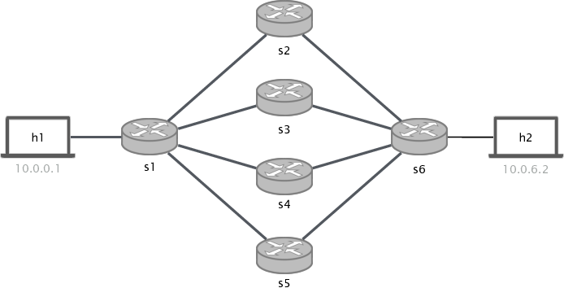

# Equal-Cost Multi-Path Routing

## Introduction

In this exercise  we will implement a layer 3 forwarding switch that is able to load balance traffic
towards a destination across equal cost paths. To load balance traffic across multiple ports we will implement ECMP (Equal-Cost
Multi-Path) routing. When a packet with multiple candidate paths arrives, our switch should assign the next-hop by hashing some fields from the
header and compute this hash value modulo the number of possible equal paths. For example in the topology below, when `s1` has to send
a packet to `h2`, the switch should determine the output port by computing: `hash(some-header-fields) mod 4`. To prevent out of order packets, ECMP hashing is done on a per-flow basis,
which means that all packets with the same source and destination IP addresses and the same source and destination
ports always hash to the same next hop.

<p align="center">

<p/>

For more information about ECMP see this [page](https://docs.cumulusnetworks.com/display/DOCS/Equal+Cost+Multipath+Load+Sharing+-+Hardware+ECMP)

## Before Starting

As usual, we provide you with the following files:

  *  `p4app.json`: describes the topology we want to create with the help
     of mininet and p4-utils package.
  *  `p4src/ecmp.p4`: p4 program skeleton to use as a starting point.
  *  `p4src/includes`: In today's exercise we will split our p4 code in multiple files for the first time. In the includes
  directory you will find `headers.p4` and `parsers.p4` (which also have to be completed).
  *  `send.py`: a small python script to generate multiple packets with different tcp port.

#### Notes about p4app.json

For this exercise (and next one) we will use a new IP assignment strategy. If you have a look at `p4app.json` you will see that
the option is set to `mixed`. Therefore, only hosts connected to the same switch will be assigned to the same subnet. Hosts connected
to a different switch will belong to a different `/24` subnet. If you use the namings `hX` and `sX` (e.g h1, h2, s1...), the IP assignment
goes as follows: `10.x.x.y`. Where `x` is the switch id (upper and lower bytes), and `y` is the host id. For example, in the topology above,
`h1` gets `10.0.1.1` and `h2` gets `10.0.6.2`.
 
You can find all the documentation about `p4app.json` in the `p4-utils` [documentation](https://github.com/nsg-ethz/p4-utils#topology-description).

## Implementing the L3 forwarding switch + ECMP

To solve this exercise we have to program our switch such that is able to forward L3 packets when there is one
possible next hop or more. For that we will use two tables: in the first table we match the destination IP and
depending on whether ECMP has to be applied (for that destination) we set the output port or a ecmp_group. For the later we
will apply a second table that maps (ecmp_group, hash_output) to egress ports.

This time you will have to fill the gaps in several files: `p4src/ecmp.p4`, `p4src/include/headers.p4`
and `p4src/include/parsers.p4`. Additionally, you will have to create a `cli` command file for each switch and name them
`sX-commands.txt` (see inside the `p4app.json`).

To successfully complete the exercise you have to do the following:

1. Use the header definitions that are already provided.

2. Define the parser that is able to parse packets up to `tcp`. Note that for simplicity we do not consider `udp` packets
in this exercise. This time you must define the parser in: `p4src/include/parsers.p4`.

3. Define the deparser. Just emit all the headers in the right order.

4. Define a match-action table that matches the IP destination address of every packet and has three actions: `set_nhop`, `ecmp_group`, `drop`.
Set the drop action as default.

5. Define the action `set_nhop`. This action takes 2 parameters: destination mac and egress port.  Use the parameters to set the destination mac and
`egress_spec`. Set the source mac as the previous destination mac (this is not what a real L3 switch would do, we just do it for simplicity). In a more realistic implementation we would create a table
that maps egress_ports to each switch interface mac address, however since the source mac address is not very important for this exercise just do this swap). When sending packets from a switch to another switch, the destination
address is not very important, and thus you can use a random one. However, keep in mind that when the packet is sent to a host needs to have the right destination MAC address.
Finally, decrease the packet's TTL by 1. **Note:** since we are in a L3 network, when you send packets from `s1` to `s2` you have to use the dst mac of the switch interface not the mac address of the receiving host, that instead
is done in the very last hop. Finally, decrease the packet's TTL by 1.

6. Define the action `ecmp_group`. This action takes two parameters, the ecmp group id (14 bits), and the number of next hops (16 bits). This
action is one of the key parts of the ECMP algorithm. You have to do several things:

   1. In this action we will compute a hash function. To store the output you need to define a metadata field. Define `ecmp_hash` (14 bits) inside
   the metadata struct in `headers.p4`. Use the `hash` extern function to compute the hash of packets 5-tuple (src ip, dst ip, src port, dst port, protocol). The signature of a hash function is:
   `hash(output_field, (crc16 or crc32), (bit<1>)0, {fields to hash}, (bit<16>)modulo)`.
   2. Define another metadata field and call it `ecmp_group_id` (14 bits).
   3. Finally copy the value of the second action parameter ecmp group in the metadata field you just defined (`ecmp_group_id`) this will be used
   to match in the second table.

**Note**: a lot of people asked why the`ecmp_group_id` is needed. In few words, it allows you to map from one ip address to a set of ports, which does not have to be
the 4 ports we use in this exercise. For example, you could have that for `IP1` you use only the upper 2 ports and for `IP2` you loadbalance using the two lower ports. Thus, by
creating two ecmp groups you can easily map any destination address to any set of ports.

7. Define the second match-action table used to set `ecmp_groups` to real next hops. The table should have `exact` matches to the metadata fields
your defined in the previous step. Thus, it should match to the `meta.ecmp_group_id` and then to the output of the hash function `meta.ecmp_hash` (which will be
a value ranging from 0 to `NUM_NEXT_HOPS-1`). A match in this table should call the `set_nhop` action that you already defined above, a miss should mark the packet
to be dropped (set `drop` as default action).  This enables us to use any subset of interfaces. For example imagine that
in the topology above we have `h2` and `h3` ( h3 does not exist, but just for the sake of the example) we could define two different `ecmp` groups (in the previous table), one that maps to port 2 and 4, and
one that maps to port 3 and 5. And then in this table we could add two rules per group, to make the outputs `[0,1]` from the hash function match [2,4] and `[3,5]`
respectively.

8. Define the ingress control logic:

    1. Check if the ipv4 header was parsed (use `isValid`).
    2. Apply the first table.
    3. If the action `ecmp_group` was called during the first table apply. Call the second table.
    Note: to know which action was called during an apply you can use a switch statement and `action_run`, to see more information about how to check which action was used, check out
    the [P4 16 specification](https://p4.org/p4-spec/docs/P4-16-v1.0.0-spec.html#sec-invoke-mau)

9. In this exercise we modify a packet's field for the first time (remember we have to subtract 1 to the ip.ttl field). When doing so, the `ipv4` checksum field need
to be updated otherwise other network devices (or receiving hosts) might drop the packet. To do that, the `v1model` provides an `extern` function that can be called
inside the `MyComputeChecksum` control to update checksum fields. In this exercise, you do not have to do anything, however just go to the `ecmp.p4` file and check how
the `update_checksum` is used.

10. This time you have to write six `sX-commands.txt` files, one per switch. Note that only `s1` and `s6` need to have `ecmp` groups installed. For all
the other switches setting rules for the first table (using action `set_nhop`) will suffice. For `s1` you have to set a direct next hop towards `h1`, and a ecmp
group towards `h2`. Set the ecmp group with `id = 1` and `num_hops = 4`. Then define 4 rules that map from 0 to 3 to one of the 4 switch output ports 
(using the second table).

## Testing your solution

Once you have the `ecmp.p4` program finished (and all the `commands.txt` files) you can test its behaviour:

1. Start the topology (this will also compile and load the program).

   ```bash
   sudo p4run
   ```

2. Check that you can ping:

   ```bash
   > mininet pingall
   ```

3. Monitor the 4 links from `s1` that will be used during `ecmp` (from `s1-eth2` to `s1-eth5`). Doing this you will be able to check which path is each flow
taking.

   ```bash
   sudo tcpdump -enn -i s1-ethX
   ```

4. Ping between two hosts:

   You should see traffic in only 1 or 2 interfaces (due to the return path).
   Since all the ping packets have the same 5-tuple.

5. Do iperf between two hosts:

   You should also see traffic in 1 or 2 interfaces (due to the return path).
   Since all the packets belonging to the same flow have the same 5-tuple, and thus the hash always returns the same index.

6. Get a terminal in `h1`. Use the `send.py` script.

   ```bash
   python send.py 10.0.6.2 1000
   ```

   This will send `tcp syn` packets with random ports. Now you should see packets going to all the interfaces, since each packet will have a different hash.

#### Some notes on debugging and troubleshooting

We have added a [small guideline](../../documentation/debugging-and-troubleshooting.md) in the documentation section. Use it as a reference when things do not work as
expected.
