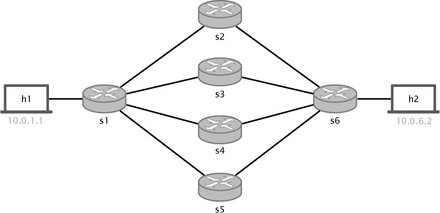

# Flowlet Switching

## Introduction

In the previous exercise we implemented ECMP, a very basic (but widely used) technique to load balance traffic across
multiple equal cost paths. ECMP works very well when it has to load balance many small flows with similar sizes (since it
randomly maps them to one of the possible paths). However, real traffic does not look as described above, real traffic is composed by many
small flows, but also but very few that are quite bigger. This makes ECMP suffer from a well-known performance problem such as hash collisions,
in which few big flows end up colliding in the same path. In this exercise we will use state and information provided by the simple_switch's
`standard_metadata` to fix the collision problem of ECMP, by implementing flowlet switching on top.

Flowlet switching leverages the burstiness of TCP flows to achieve a better load balancing. TCP flows tend to come in bursts (for instance because
a flow needs to wait to get window space). Every time there is gap which is big enough (i.e., 50ms) between packets from the same flow, flowlet switching
will rehash the flow to another path (by hashing an ID value together with the 5-tuple).

For more information about flowlet switching check out this [paper](https://www.usenix.org/system/files/conference/nsdi17/nsdi17-vanini.pdf)

<p align="center">

<p/>


## Before Starting

As usual, we provide you with the following files:

- `p4app.json`: describes the topology we want to create with the help of mininet and p4-utils package.
- `network.py`: a Python scripts that initializes the topology using *Mininet* and *P4-Utils*. One can use indifferently `network.py` or `p4app.json` to start the network.
- `p4src/flowlet_switching.p4`: p4 program skeleton to use as a starting point.
- `p4src/includes`: In the includes directory you will find `headers.p4` and `parsers.p4` (which also have to be completed).
- `send.py`: a small python script to send burst of packets that belong to the same flow.

#### Notes about p4app.json

For this exercise (and the next two) we will use a new IP assignment strategy. If you have a look at `p4app.json` you will see that
the option is set to `mixed`. Therefore, only hosts connected to the same switch will be assigned to the same subnet. Hosts connected
to a different switch will belong to a different `/24` subnet. If you use the namings `hY` and `sX` (e.g h1, h2, s1...), the IP assignment
goes as follows: `10.x.x.y`. Where `x` is the switch id (upper and lower bytes), and `y` is the host id. For example, in the topology above,
`h1` gets `10.0.1.1` and `h2` gets `10.0.2.2`.
 
You can find all the documentation about `p4app.json` in the `p4-utils` [documentation](https://nsg-ethz.github.io/p4-utils/usage.html#json). Also, you can find information about assignment strategies [here](https://nsg-ethz.github.io/p4-utils/usage.html#automated-assignment-strategies).

## Implementing the flowlet switching enhancement

This exercise is an enhancement of ECMP, and thus you can start by copying all the code. You will use exactly the same headers,
parser, tables, and cli commands (so you do not need to write this part either).

To solve this exercise you will have to use two registers, one for `flowlet_ids` (hash seed) and one to keep the last timestamp of
every flow. You will have to slightly change the ingress logic, define a new action to read/write the flowlet registers. And modify
the hash function used in ECMP, adding a new field (the `flowlet_id`) which will vary over time.

You will have to fill the gaps in several files: `p4src/flowlet_switching.p4`, `p4src/include/headers.p4`
and `p4src/include/parsers.p4`.

To successfully complete the exercise you have to do the following:

1. Like in the previous exercise, header definitions are already provided.

2. Define the parser that is able to parse packets up to `tcp`. Note that for simplicity we do not consider `udp` packets
in this exercise. This time you must define the parser in: `p4src/include/parsers.p4`.

3. Define the deparser. Just emit all the headers.

4. Copy the tables and actions from the previous exercise. You will have to slightly modify them.

5. Define two registers `flowlet_to_id` and `flowlet_time_stamp` (for register sizing use the constant defined at the
beginning of `flowlet_switching.p4` file: REGISTER_SIZE, TIMESTAMP_WIDTH, ID_WIDTH). We will use this two registers to keep two things:

    1. In `flowlet_to_id` register we keep the id (a random generated number) of each flowlet, this id is now added to the
    hash function that devices the output port. As long as this id does not change, packets for that flow will stay in the same path.

    2. In `flowlet_time_stamp` register we keep the last timestamp for the last observed packet belonging to a flow.

6. Define an action to read the flowlet's register values (`read_flowlet_registers`). In this action you will have to hash the 5-tuple
of every packet the index you will use to read the flowlet registers (to save the index you will need to define a new metadata field with a
width size of 14 bits). Using the index you got from the hash function read flowlet id and last timestamp and save them in a metadata field (you
also have to define them). Finally, update the timestamp register using `standard_metadata.ingress_global_timestamp`.

7. Define another action to update the flowlet id (`update_flowlet_id`). We will use this action to update flowlet ids when needed.
In this action you just have to generate a random number, and then save it in the flowlet to id register (using the
id you already computed previously).

8. Modify the `hash` function you defined in the ECMP exercise (`ecmp_group`), now instead of just hashing the 5-tuple, you have to
add the metadata field where you store the `flowlet_id` you read from the register (or you just updated).

9. Define the ingress control logic (keep the logic from the ecmp example and add):

    Before applying the `ipv4_lpm` table:

    1. Read the flowlet registers (calling the action)
    2. Compute the time difference between now and the last packet observed for the current flow.
    3. Check if the time difference is bigger than `FLOWLET_TIMEOUT` (define at the beginning of the file with a default
    value of 200ms).
    4. Update the flowlet id if the difference is bigger. Updating the flowlet id will make the hash function output a new value.
    5. Apply `ipv4_lpm` and `ecmp_group` is the same way you did in `ecmp`.


10. Copy the `sX-commands.txt` from the previous exercise.

## Testing your solution

Once you have the `flowlet_switching.p4` program finished you can test its behaviour:

1. Start the topology (this will also compile and load the program).
   ```bash
   sudo p4run
   ```
   or
   ```bash
   sudo python network.py
   ```

2. Check that you can ping:

   ```bash
   mininet> pingall
   ```

3. Monitor the 4 links from `s1` that will be used during `ecmp` (from `s1-eth2` to `s1-eth5`). Doing this you will be able to check which path is each flow taking.

   ```bash
   sudo tcpdump -enn -i s1-ethX
   ```

4. Ping between two hosts:

   If you run a normal ping from the mininet cli, or using the terminal, by default it will send a ping packet every 1 second. In this
   case every ping should belong to a different flowlet, and thus it should be crossing different paths all the time.

5. Do iperf between two hosts:

   If you do iperf between `h1` and `h2` you should see all the packets cross the same interfaces almost
   all the time (unless you set the gap interval very small).


6. Get a terminal in `h1`. Use the `send.py` script.

   ```bash
   python send.py 10.0.6.2 1000 <sleep_time_between_packets>
   ```

   This will send `tcp syn` packets with the same 5-tuple. You can play with the sleep time (third parameter). If you set it bigger than your gap, packets should change
   paths, if you set it smaller (set it quite smaller since the software model is not very precise) you will see all the packets cross the same interfaces.

#### Some notes on debugging and troubleshooting

We have added a [small guideline](https://github.com/nsg-ethz/p4-learning/wiki/Debugging-and-Troubleshooting) in the documentation section. Use it as a reference when things do not work as
expected.


