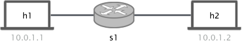
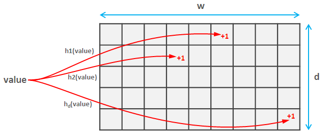

# Count-Min Sketch

## Introduction

<p align="center">

<p/>

In today's exercise we will implement a new probabilistic data structure. The Count-Min Sketch. As you have seen during the lecture
the Count-min sketch is a probabilistic algorithm that can be used to estimate occurrences of distinct elements (similar to the counting bloom filter
we saw in last week lecture and previous exercise).

To implement the count-min sketch we will use `registers` and `hash` functions. This time though, we will
have to define several registers and use a different hash function for each of them. To count packets belonging to a flow using the count-min
sketch we have to hash every packet's 5-tuple (src,dst, sport, dport, proto) using N different hash functions. Each hash output is used to index a different register
and increase its value by 1 (as you can see in the picture below). In order to read how many entries were counted for a given flow, we have to hash the 5-tuple, read
the value at every register and pick the minimum.

<p align="center">

<p/>

In this exercise we will implement a count-min sketch with P4, a controller that will pull the counters from the switch and decode them, and finally play with the dimensions
of the sketch.


### Disabling debugging in the bmv2 switch

To test the performance of our sketch we will need to send hundreds of thousands of packets through the switch. As you have already seen in the
previous exercises, if you do an `iperf` between to directly connected hosts you get roughly a bandwidth of `15~20mbps`. In order to be able to send
packets fast to the switch we can clone the repository again with a different name and compile it with different flags. Since this process can take up to
10 minutes you can just leave it running in the background.

```bash
cd ~/p4-tools/
git clone https://github.com/p4lang/behavioral-model.git bmv2-opt
cd bmv2-opt
git checkout b447ac4c0cfd83e5e72a3cc6120251c1e91128ab
./autogen.sh
./configure --without-nanomsg --disable-elogger --disable-logging-macros 'CFLAGS=-g -O2' 'CXXFLAGS=-g -O2'
make -j 2
sudo make install
sudo ldconfig
```

**IMPORTANT:** It is recommended that you do not run the `sudo make install` command until you have a working solution. When using this optimized compilation the
switch will not generate log files, and thus it will be hard for you to properly debug your program.

Since we keep the two compiled versions of `bmv2` in different folders, you can enable the one with the `debugging` enabled by just running the `make install` command
again:

```bash
cd ~/p4-tools/bmv2
sudo make install
sudo ldconfig
```

Thus by running `sudo make install` in `~/p4-tools/bmv2` or `~/p4-tools/bmv2-opt` you can easily enable each compiled version.

### What is already provided

For this exercise we provide you with the following files:

  *  `p4app.json`: describes the topology we want to create with the help
     of mininet and p4-utils package.
  *  `p4src/cm-sketch.p4`: p4 program skeleton to use as a starting point. Furthermore, we provide you the `headers.p4` and `parsers.p4` file such that you do not
  have to write this again.
  *  `send.py`: python program that uses raw sockets to send packets (`scapy` was not fast enough for what we needed in this exercise).
  *  `cm-sketch-controller.py`: controller that uses the `runtime_API` to communicate with the switch. You will find some util functions that
  will help with the sketch decoding. Here you will also have to implement part of the algorithm.
  * `crc.py` a python `crc32` implementation that will be used by the controller to read the counters.

#### Notes about p4app.json

For this exercise we will use the `mixed` strategy, however this is not very important since we will just use the switch to send packets
through it and run the count-min sketch. In this small topology, where `h1` and `h2` are connected to the same switch `s1` the ip assignment is
`10.0.1.1` and `10.0.1.2` respectively.
 
You can find all the documentation about `p4app.json` in the `p4-utils` [documentation](https://github.com/nsg-ethz/p4-utils#topology-description).

## Implementing the count-min sketch and the decoding controller

To solve this exercise we have to do two things: i) implement the count-min sketch in P4, ii) decode the values using a the controller and compare them with
the ground truth.

#### Count-min Sketch

The program running in the switch needs to be able to do two things:

   * Forward packets from port 1 to 2 and vice-versa.
   * Execute the Sketch for every `tcp` packet observed.

To successfully complete the p4 program you have to:

1. Define a forwarding table that forwards packets from port 1 to port 2 and vice-versa. This is exactly what we did in the `repeater` exercise, thus you can
copy your solution from there. The table should match the `ingress_port` and in case of match call a `set_egress_port` action.

2. Define the `set_egress_port` action. The action gets an `bit<9> egress_port` number and sets it as `egress_spec`.

3. Define the `s1-commands.txt` file to fill the table. You just need two entries.

4. Define `N` registers. To set the width of each register cell use the constant `SKETCH_CELL_BIT_WIDTH`.
To set the register size use the `SKETCH_BUCKET_LENGTH` constant (which you have to define depending on your needs). In order to easily
read the registers from the controller name them as follows: `sketch<num>` for example: `sketch0`, `sketch1`,.., `sketchN`.

5. Define the `sketch_count` action. In this action you should do the following for each register:

   1. Define N metadata field of width 32 in which to store the output of each hash computation.
   2. Define N metadata fields of width `SKETCH_CELL_BIT_WIDTH` to store the counter read from each register.
   3. Hash the packets 5-tuple in this order: srcAddr, dstAddr, srcPort, dstPort, protocol. Send the output to the metadata field you just
   defined. As a max (or module) value for the hash use the constant `SKETCH_BUCKET_LENGTH`. **Important:** use the `HashAlgorithm.crc32_custom`: since
   we want to potentially define N hash functions and only few algorithms are available, we will use the `crc32_custom` algorithm that the simple switch provides.
   The polynomial of this algorithm can be modified at runtime by the controller, in our case (this is provided) the controller will automatically
   configure all the hash functions with different polynomials such that they return different hash outputs.
   You can read more about the `crc32` configuration [here](https://www.cosc.canterbury.ac.nz/greg.ewing/essays/CRC-Reverse-Engineering.html).
   4. For each hash output value (index to register) read the count value of its respective register and save it into the variables defined in 2. Add one to
   the variable and write that to the register. Make sure that you use the output of your `hash0` with `sketch0`.

6. Define the ingress block logic. Apply the `forwarding` table. Furthermore, if the packet is `ipv4` and `tcp` apply the `sketch_count` action.

#### Controller

In order to read the count-min sketch counter you will have to implement a small algorithm at the controller. We provide you with a partial controller
implementation that already does several things for you. Amongst others, the controller does:

1. Configures the `crc32_custom` hash algorithms that you defined in the switch (at the moment it can do up to 16 hashes). This is done by the function `set_crc_custom_hashes`.
This function uses the `runtimeAPI` (which uses the `thrift` API) to set the polynomials of each `crc`. You can see the list of polynomials at the beginning of the file.

2. It will create some `crc32` hash objects and append them to `self.hashes`. Note that this hashes (implemented in python) are the same than the ones you will be
running in the switch. Thus `self.hashes[0]` == the first hash you defined in your P4 program. To get the output of the hash you have to call the method `bit_by_bit_fast(5-tuple)`.

To successfully implement the controller you have to:

1. Define a function to read the N registers and save them in order in `self.registers` list. To read a register use the controller API: `self.controller.register_read(<name>)`, this will
return a list with all the register fields. The amount of registers available in the switch  (which should be the same than hashes) can be found in `self.register_num`. Remember that
if you named your registers with the following pattern `sketch<num>` you can easily read them with a simple iteration.

2. Define a function to get the count of a given flow. As an input the function needs the flow's 5-tuple and the length of the registers (to use it to modulo the output of the hash). To successfully
implement this function you should hash the flow 5-tuple with all the different hash functions `self.hashes[i]` (remember to apply the modulo to the output to get the right index). For each hash `i` read the
`self.registers[i][hash_output[i]]` and return the minimum of them. The hash function takes a bytestream as input, to generate the bytestream out of the 5-tuple use
the function `flow_to_stream(flow)`, the input parameter has to be a list or tuple of the form ("10.0.1.1", "10.0.1.2", 5000, 7000). Note that the protocol is not needed and will be automatically added.

3. Define the main (call it `decode_registers`) function to decode all the registers and compare them with the ground truth. This function has as input: epsilon, number of packets used in the
experiment, registers length, and a file with the flows sent during the experiment (to know more about this check out the testing the solution section). In more details
you have to:

   1. Read the registers (call the function you defined in 1).
   2. Load the `sent_flows.pickle` file. This file contains a python dictionary with the ground truth. The dictionary is of the form `{(flow): packet_count}`. To load a pickle file you need to use: `pickle.load(open(file_name, "r"))`
   3. For each flow read the count value out of the registers using the function defined in 2.
   4. For each flow you can check if you are inside the bound: counter <= (`real_counter` + ϵ*η).
   5. You can also determine if 4 holds with probability 1 - δ.
   6. You are free to compute any statistics out of your computations, such as total error, relative errors to single flows, etc.

**Note:** that all the variables needed to solve the above items can be passed through command line parameters. See the `cm-sketch-controller.py` file at the bottom.

#### Dimensioning

In today's lecture you have learned that a count-min sketch holds the following properties:

   1. The estimated count value will be the same as the real or bigger.
   2. The error will be not bigger than `real_count` + ϵ*η with probability 1 - δ.  Where ϵ is the error factor, η is the number of
   packets hashed and δ is the error probability.

After some analysis we can get some formulas for determining the dimensions of the array and the number of them as:

 * `Number of registers:` ceil(ln(1/δ))
 * `Register length:` ceil(e/ϵ)

For example, if we want a ϵ=0.1 and δ=0.05. Registers = 3, length=28.

## Testing the solution

To test our solution we will use the `send.py` script you can find in the provided files. This script uses raw sockets
to generate random flows. The number of packets, flow size, and flow distribution can be configured by tuning the command line
parameters:

```
parser.add_argument('--n-pkt', help='number of packets', type=int, required=False, default=5000)
parser.add_argument('--n-hh', help='number of heavy hitters', type=int, required=False, default=10)
parser.add_argument('--n-sfw', help='number of small flows', type=int, required=False, default=990)
parser.add_argument('--p-hh', help='percentage of packets sent by heavy hitters',type=float, required=False, default=0.95)
```

On top of sending the random flows, the script will save in a file a dictionary with `{(flows): packets_sent}`. This dictionary
can be used as a ground truth by the controller to compare the number of packets sent and the number counted by the count-min sketch.


We will also use the controller we provided you and that you had to modify and enhance. The controller can be called using the following
parameters:

```
parser.add_argument('--sw', help="switch name to configure" , type=str, required=False, default="s1")
parser.add_argument('--eps', help="epsilon to use when checking bound", type=float, required=False, default=0.01)
parser.add_argument('--n', help="number of packets sent by the send.py app", type=int, required=False, default=1000)
parser.add_argument('--mod', help="number of cells in each register", type=int, required=False, default=4096)
parser.add_argument('--flow-file', help="name of the file generated by send.py", type=str, required=False, default="sent_flows.pickle")
parser.add_argument('--option', help="controller option can be either set_hashes, decode or reset registers", type=str, required=False, default="set_hashes")
 ```

#### Testing Correct behaviour

Dimension your sketch using ϵ=0.1 and δ=0.05 (as shown above). Then start the topology, configure the hash functions
with the controller and send traffic from `h1` using send.py to send few flows (just to test).

1. Star the topology with `sudo p4run`

2. Set the hash functions polynomials by running the default controller with `set_hashes` as option parameter. This will set the right polynomials
to the running switch so when we decode we are use the same exact hash.

```bash
python cm-sketch-controller.py --option "set_hashes"
```

3. Get a terminal in `h1` and send a bit of traffic (only 2 flows) to test if your decoder works.

```bash
mx h1
python send.py --n-pkt 1000 --n-hh 2 --n-sfw 0 --p-hh 1
```

This script will create two flows of size approximately 500 packets. It will also save in `sent_flows.pickle`
a dictionary with the exact number of packets sent by each flow.

The controller decoding function should read this file and try to extract the counters for those flows and check if the
count is inside the boundary.

4. Finally, run the controller with the `decode` option enabled and the right parameters for the decoding.

```
python cm-sketch-controller.py --eps 0.1 --n 1000 --mod 28 --option decode
```


#### Playing with dimensions

Before starting more tests make sure you install the optimized version of `bmv2`. Furthermore, open the `send.py` file
go to the `send_n` function and replace `time.sleep(0.001)` by `time.sleep(0.0002)`. With the optimized version we can sent packets
5 times faster.

Now instead of just sending 2 flows, we will mix big and small flows. Run `send.py` with the following parameters:

```bash
mx h1
python send.py --n-pkt 100000 --n-hh 10 --n-sfw 990 --p-hh 0.95
```

You should see that big flows have a good size estimation, however small flows will all be far from the real value. This due to the
size of the register (28 cells). Small flows send between 0 and 10 packets, however the expected value of each cell is around 150.

If you increase the cell size to something much bigger, for example 4096, and repeat the test (make sure you reboot the switch and the controller). You will see that
the estimation count and real values will be very close (if not exactly the same).

At this point you should be able to reason about how to dimension your count-min sketch depending on what your traffic mix looks like, and what do you want to achieve. Modify the number
of registers and size and play with different traffic distributions to check if the theory you learned during the lecture holds.

#### Some notes on debugging and troubleshooting

We have added a [small guideline](../../documentation/debugging-and-troubleshooting.md) in the documentation section. Use it as a reference when things do not work as
expected.
