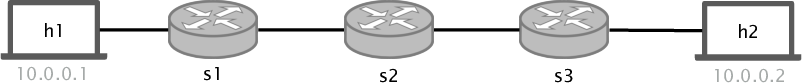
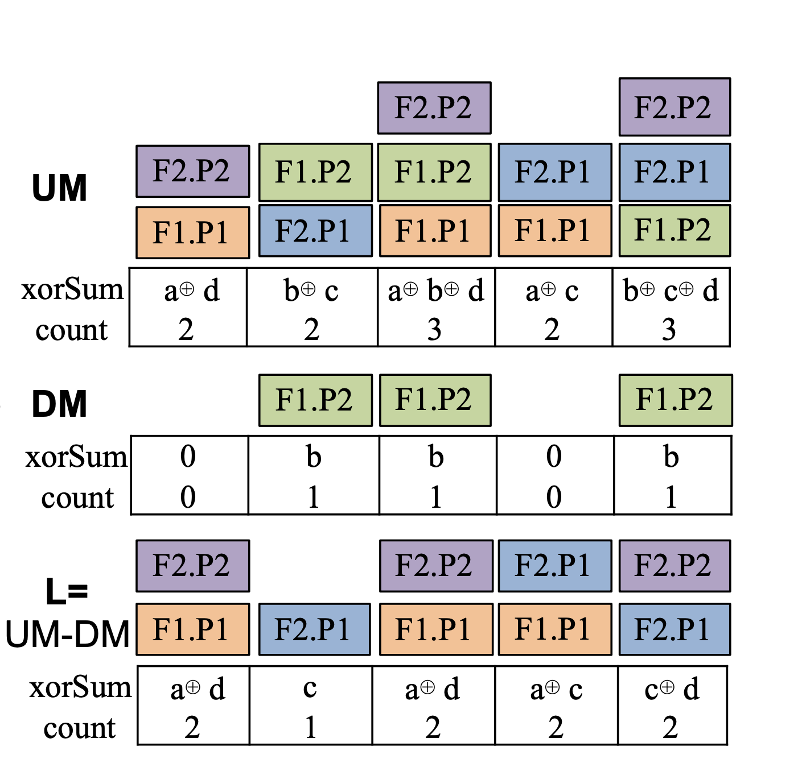
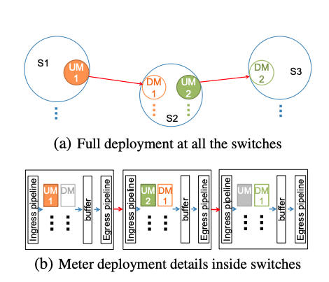
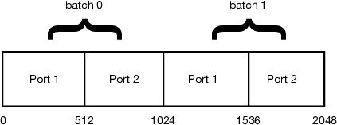

# Packet Loss Detection

## Introduction

<p align="center">

<br>
<em>Fig. 1: Three hop linear topology</em>
<p/>

In today's exercise we will implement a state of the art packet loss detection system called `LossRadar`. This exercise is based on recent research and a paper published
few years ago: LossRadar: Fast Detection of Lost Packets in Data Center Networks. We will provide you with all the knowledge and information needed to implement the exercise.
If you want to know more you can find the paper [here](http://minlanyu.seas.harvard.edu/writeup/conext16.pdf).

Packet losses are very common in nowadays networks. Those losses can be caused by many reasons: congestion, blackholes, faulty links or corrupted
forwarding tables. Even if small, losses can have a significant impact on the network performance and thus detecting and localizing them fast
is fundamental. Furthermore, being able to get information (i.e header fields) of the packets that get dropped can be extremely useful when trying to
find the root cause of the drop.

In this exercise we will show you how to achieve all those requirements by combining the data plane per packet processing capabilities and a small decoding algorithm that will run
in the controller. The main idea behind this packet loss detection system are the [invertible bloom lookup tables (IBLT)](https://medium.com/codechain/invertible-bloom-lookup-table-37600927cfbe),
a probabilistic data structure that you have seen during this lecture. We saw that IBLTs can be used to store key value pairs.
In this exercise, we will see that an IBLT can also be used to efficiently track missing items between two entities (we will call them traffic digests). Let's see how this works with an example:

Imagine that for every unidirectional link in the network, we keep two IBLTs. One called Upstream meter (UM, placed at the sending switch) and one called Downstream meter (DM, placed at the receiving switch). Each
IBLT consists of an array of cells, and each cell contains a packet `count` and a `xorSum`.

For each packet that crosses the link we do the following:

1. We hash some header fields (i.e 5-tuple + IP id, as we will do in this exercise) using multiple hash functions.
2. Then we use the hash indexes to update the IBLT array fields as follows: `count = count + 1` and `xorSum = xorSum XOR pkt.signature`. The signature should contain all the
cells used by to obtain the hash indexes and could have some extra ones if wanted.

The figure below shows one Upstream and one Downstream traffic digest or IBLT. As you can see with the coloured boxes, the upstream (the sending
switch) contains 4 different packets (different colours) that have been hashed 3 times in different cells. Also note that each cell contains a count with
the number of packets stored in the cell and an XOR of all the `pkt.signatures`. Then those packets are transmitted to the downstream switch where the same process is repeated.
However, as you can see in this crafted example, the blue, orange and purple packets have been lost and thus are not contained inside the DM digest.

<p align="center">

<br>
<em>Fig. 2: Upstream and downstream traffic digests. Credit: LossRadar</em>
<p/>

Once the packets have passed both meters the IBLT can be decoded. To do that the controller will have to pull the content of the register
arrays and subtract the digests `L=UM-DM`. In order words, for each counter cell `i` we have to do `L_count(i) = UM_count(i) - DM_count(i)`, and for each `xorSum` cell
we do `L_xorSum(i) = UM_xorSum(i) XOR DM_xorSum(i)`. Some reminder on Xoring: `A xor A = 0`, `A xor B xor A = B`. Thus if the packets have been
added to both digests they will always be canceled leaving only the dropped packets in `L`.

One of the challenges of this system and in general network measurements is synchronization. If both meters are not perfectly synchronized we will detect
packet losses that did not happen. To make sure that the meters that are exchanged where exposed to the exact same set of packets `batches` are used. As you will
see during the exercise, one way of doing that is by letting the UM switch tag packets with a `batch_id` such that the DM switch counts them in the same batch. This batch
id can be something that changes every 1 second for example. When counting packets for 1 batch the controller has some time to pull and clean the region of the meters
that correspond to the previous batch while the switches are not modifying it. One way of synchronizing this with the controller is making the UM switch track all
the time if there is a batch ID change and if so notify the controller so it pulls the previous batch meters.

In order to decode `L` and find out which packets have been dropped, the controller does the following:

1. Finds a the cells with `count = 1` (we call them pure cells). The `xorSum` of a pure cells contains the packet header (`pkt.signature`) information
we decided to add to it. For example the packet's 5-tuple and some extra fields.
2. Uses the `pkt.signature` from the pure cell to obtain the `K` hash indexes that the switch computed when adding the packet to the meter. Then
it uses those indexes to subtract 1 to the `counter` field in those array cells and XOR the `pkt.signature`. By doing this, some new pure cells appear, for example, in the figure above. If you remove the blue packets, then the fourth cell
will have a pure orange packet. This process is then repeated until there are no more pure cells or the digest is empty.
3. All the packets found during the iterative process can be reported as dropped packets in the link (with direction UM->DM) where the UM and DM where placed.

In order to cover all the links in the network we will install one upstream meter at each output port of every switch, and one downstream meter at
each input port of every switch. In this way both directions of every link are covered. In fact, we need two pairs of upstream meters and downstream
meters for each bidirectional link. You can see depicted the placement of this meters in the picture below. However, for conciseness there is only
one pair drawn.

<p align="center">

<br>
<em>Fig. 3: Shows how the UM and DM are placed in the pipeline. Credit: LossRadar</em>
<p/>

As explained in the paper, it is important to note that both meters are placed at the end of the ingress pipeline after
all the tables and before the traffic manager. Also it is important to note that the upstream meter is executed
before than the downstream meter so that the segments between the UM and the DM are also covered.

Now its time to implement your own packet loss detection application using P4 switches and a controller to decode the packet digests.

## Before Starting

### Updating p4-utils

Before you start this exercise, update `p4-utils`, some new features have been added for the completion of this exercise.

```bash
cd ~/p4-tools/p4-utils
git pull
```

### Disabling debugging in the bmv2 switch

As you already did for the sketch exercise you can disable the debugging options by compiling the bmv2 again using a new build directory:

```bash
cd ~/p4-tools/
git clone https://github.com/p4lang/behavioral-model.git bmv2-opt
cd bmv2-opt
git checkout 62a013a15ed2c42b1063c26331d73c2560d1e4d0
./autogen.sh
./configure --without-nanomsg --disable-elogger --disable-logging-macros 'CFLAGS=-g -O2' 'CXXFLAGS=-g -O2'
make -j 2
sudo make install
sudo ldconfig
```

**IMPORTANT:** It is recommended that you do not run the `sudo make install` command until you have a working solution. When using this optimized compilation the
switch will not generate log files, and thus it will be hard for you to properly debug your program.

Since we keep the two compiled versions of `bmv2` in different folders, you can enable the one with the `debugging` enabled by just running the `make install` command
again:

```bash
cd ~/p4-tools/bmv2
sudo make install
sudo ldconfig
```

Thus by running `sudo make install` in `~/p4-tools/bmv2` or `~/p4-tools/bmv2-opt` you can easily enable each compiled version.

### What is already provided

For this exercise we provide you with the following files:

- `p4app.json`: describes the topology we want to create with the help of mininet and p4-utils package.
- `network.py`: a Python scripts that initializes the topology using *Mininet* and *P4-Utils*. One can use indifferently `network.py` or `p4app.json` to start the network.
- `p4src/loss-detection.p4`: p4 program skeleton to use as a starting point. Furthermore, we provide you an almost complete `headers.p4` and `parsers.p4` files.
- `send.py`: python program that uses raw sockets to send packets (`scapy` was not fast enough for what we needed in this exercise).
- `packet-loss-controller.py`: controller that uses the `thrift_API` to communicate with the switch. You will use it to configure the switches, to receive event notifications and decode the IBLT.
- `crc.py` a python `crc32` implementation that will be used by the controller to match the same hash functions that the switch used.

#### Notes about p4app.json

Since the goal of this exercise is forwarding we will use the `l2` strategy to create the topology. This strategy places all the hosts
in the same subnet. This will force hosts to send packets with the right destination MAC address making it easier for us so that we do
not have to set it with the switches. Thus, `h1` and `h2` get assigned with `10.0.0.1` and `10.0.0.2` respectively.
 
You can find all the documentation about `p4app.json` in the `p4-utils` [documentation](https://github.com/nsg-ethz/p4-utils#topology-description).

## Implementing the packet loss detection system

To solve this exercise we have to do two things: i) implement in P4 all the logic needed to create the packet digests, ii) decode the content of the digest using
the controller to determine which packets got lost.

#### Data Plane Implementation in P4

Before starting have a look at the header and parser files, we provide you
with some headers and parser logic, however you will still have to add a bit.

1. Define the `loss_t` header. It should have 3 fields, 1 bit for a `batch_id`, 7 bits of padding
and 8 bits for a `nextProtocol` field. Since we will place this header between
the IP and Transport protocols, we will use the next protocol id to tell the parser
whats next.

2. Go to the parser file and enhance the logic such that the parser will parse the
loss header after the IP and if so, it will also parse TCP and UDP packets. For the loss
header use the IP type (`TYPE_LOSS`) defined as a constant in the `header.p4` file.

Now you should be ready to start the main P4 program. Here we will have to define
a bunch of registers, tables, actions and control logic (some will be provided).

3. Define the `remove_loss_header` table. This table should match to the `egress_spec`
and call an action called `remove_header`. This table will be used to remove the loss header
once the packet travels from a switch to a host. Note that the controller will populate this
table for you and thus you have to make sure you use the same naming.

4. Define the `remove_header` action. This action should set the loss header to invalid. Set the right
IP next protocol, and subtract 2 to the `IP LEN` field (which is the size in bytes of the `loss_t` header)

5. At the beginning of the ingress pipeline define 8 registers, 4 for the UM and 4 for the DM. The register
cells should be `64bit` long and the size of the register should be `REGISTER_SIZE_TOTAL` which is a constant
defined at the beginning of the file. In these registers we will store 2 things, the packet `count` and the `xorSum`
of the packets that cross the switch. Due to limitations with the software switch API the maximum size a register can have is `int 64`
and thus we will split the fields we want to store in `xorSum` into multiple registers as follows:
    1. One Register for the source ip.
    2. One Register for the destination ip.
    3. One register for the srcport + dstport + ip proto + id.
    4. One register for the packet `count`.

    For consistency you can call them `um_ip_src` and `dm_ip_src`, etc.

    **IMPORTANT:** We asked you to define the registers with size `REGISTER_SIZE_TOTAL` which is set to 2048.
    If you look at the constants on top of the file you will see two more: `REGISTER_BATCH_SIZE` and `REGISTER_PORT_SIZE`. As you can
    see in Figure 4 we will split our registers in 4 regions, this will be very important because you will need to be careful when reading
    them or when you generate hash indexes. As you can see in the image, we will reuse the same register for the different ports the switch has
    and for the two meter batches that we considered in the implementation. Those meter batches are used so that the controller can read/clean one
    part of the meter while the other is being filled by packets. As you will see later, switches use time to keep track of the current batch id.


<p align="center">

<br>
<em>Fig. 4: Register port and batch structure</em>
<p/>


6. Define the `compute_hash_indexes` action. This action has to define 6 crc32_custom hash functions (as we did in the sketch
exercise). We will use 3 hashes to get indexes for the UM digest, and 3 hashes to get the indexes for the DM digest. There are
three important things you have to consider while defining the hashes:
    1. Define 6 metadata fields in which you will store the hash outputs.
    2. For the hash fields, use the packet 5 tuple and the ip protocol. Keep in mind that the transport layer protocols are saved in `meta.tmp_src_port`
    and `meta.tmp_dst_port` (this will be explained a bit below). Also, the IP protocol should be stored in `hdr.loss.nextProtocol`.
    3. You need to consider the array distribution explained above to select the hash min and max values. For the Upstream meters you have to compute min as:
    `((meta.batch_id * REGISTER_BATCH_SIZE) + ((((bit<16>)standard_metadata.egress_spec-1)*REGISTER_PORT_SIZE)))` and max as `min+REGISTER_PORT_SIZE`. Note that
    we use the locally generated batc_id, and the output port. For the downstream meters you have to compute the hash min as: `((meta.previous_batch_id * REGISTER_BATCH_SIZE) + ((((bit<16>)standard_metadata.ingress_port-1)*REGISTER_PORT_SIZE)))` and the max as  `min+REGISTER_PORT_SIZE`. Note that we use the `batch_id` received from the
     upstream switch, and the `ingres_port`.

7. Implement the `apply_um_meter` action. Here you have to use the 3 indexes obtained form the `um_hashes` and update the 4 registers defined in task 5. For the `counter`
register you just have to increase by 1. For the `src_ip`, `dst_ip` and `ports_proto_id` registers you have to `xor` its content with the receive packets fields. For each register
you have to perform 3 reads and 3 writes. You will need to store the values you read from the registers somewhere, you can use local variables or metadata
fields that you can reuse for the next action.

8. Implement the `apply_dm_meter` action. Do the same for the DM registers using the 3 DM indexes obtained in `compute_hash_indexes`.

9. Since this time the ingress pipeline is quite complex we will provide it to you. The pipeline consists of the following blocks:
    1. We first set the udp/tcp ports to the `meta.tmp_src/dst_port` field. This is used as a indirect reference so that no matter
    which transport protocol do we have, we will always find the ports values in the same metadata field.
    2. We run the forwarding table to set the output port.
    3. If the packet does not have a `loss` header, due to the fact that this is the first switch, we add the header, and update some IP header
    fields. Note that at the end we set to 1 the `meta.dont_execute_dm` field. This is used to avoid executing the DM meter since this packet comes
    from a host. In the case the packet already had a `loss` header we set the `meta.previous_batch_id` to the one the packet carried in its header.
    4. We compute the local batch id, this is done using the `ingress_global_timestamp` shifting it by 2**21 (approximately 2 seconds) and doing a modulo 2. This
    will make the `batch_id` to oscillate between 1 and 0 approximately every 2 seconds.
    5. In the next block we will read the previous `batch_id` we observed in this switch. If the id changed since the last packet, we will generate
    a clone packet to notify the controller that it should export the meters for this batch id from this switch and all neighbors.
    6. We update the headers `batch_id`
    7. Compute the hash indexes.
    8. Remove the `loss` header if the next hop is a host.
    9. Apply the UM and DM meters.
    10. Decrease the packet if `ip.ttl = 1`. Decrease it by one otherwise.

10. If we receive a packet that was cloned, we have to add the `loss` header, set the `batch_id` to the last local id observed by this switch
and send it to the controller. We truncate the packet to 16 bytes since we only need `ethernet+loss` headers.

#### Controller Implementation

Once you have the data plane implementation finished you can start with the controller. We provide you with some
basic functions and you will have to implement the main decoding algorithm. If you have a look at the controller
you can see the following functions implemented:

1. `run_cpu_port_loop` and `recv_msg_cpu`. The first function uses scapy and listen to all the cpu ports that connect
to the switches. The second function extract the control packets your data plane application will be sending to the
controller every time a batch_id gets updated. This function will finally call `check_sw_links` which is where you
will run the main algorithm.

2. `connect_to_switches`: creates a controller API for all the switches and stores them in a dictionary of the form: {sw_name:controller}.

3. `configure_switches`: populates the tables and sets the mirroing id for cloned packets.

4. `set_crc_custom_hashes` sets the 3 UM hashes and the 3 DM hashes, similarly to what we did in the sketch exercise.

5. `create_local_hashes` emulates the hashes we created in the switch so we have them in the controller.

6. `reset_all_registers` sets all the registers to 0

7. `reset_registers` this functions is very importat it allows you to reset a specific area of a UM or DM digest.

8. `read_registers` loads all the registers into `self.registers

9. `extract_register_information` for a given switch, stream direction, port and batch id it returns the array region
where the information for those parameters is stored.

By using all this functions and the decoding algorithm explained in the introduction you have to:

1. Implement `check_sw_links` function. If you have a look at the code you can see that this function will be called by `recv_msg_cpu` function which
is already implemented. This function will be called with two parameters: the name of the switch that notified the controller, and the batch ID that need to
be decoded. In this function you have to do the following:

    1. Wait a bit of time using the sleep library. This is done to make sure that packets that could have been buffered between the switches that have been tagged
    with this batch id have already arrived at the DM switch.
    2. Read the content of the registers from this switch and directly connected switches.
    3. For all the neighboring switches call the function `verify_link(sw1, sw2, batch_id)` make sure you the switch that triggered the controller as `sw1`.

2. Implement the `verify_link` function. This is the function you have to call in your previous task. Here you have to do the following:
    1. Get the port numbers (using the controller API) of the link that connects `sw1` and `sw2`.
    2. Extract the right region of the registers from `sw1` UM and `sw2` DM. For that you can use the already implemented function `extract_register_information`.
    3. Call the function `decode_meter_pair(um, dm)`, this function should return a set with the dropped packets. You will implement it in the next task.
    4. Clean the array region that belongs to the ports and batch id for the UM and DM of these switches. You can use the `reset_registers` function.
    5. Print or show nicely which packets get dropped so you can verify that your solution works.

3. Implement the decoding function described in the exercise introduction. As a parameter you will get 2 dictionaries with the 4 registers read from the
switch, you can have a look at the dictionary to see the namings. What you should do is:
    1. For each array cell do the counter difference UM-DM. And for all the other registers do the XOR between UM and DM.
    2. Implement the algorithm described above. In brief, while there is a counter cell equal to 1, extract the packet, use it to get the 3 hash indexes, and clean
    the correspondent cells, by doing -1 to the counter ones, and `xor` of the packet values to the other register cells.
    3. Each time you find a dropped packet add it to a set/list.
    4. Once you do not find more ones, return the list of dropped packets.

## Testing the solution

*NOTE:* Once you think that you have a stable working solution, use the optimized software switch. Follow the steps
descrived above.

To test our solution we will use the `send.py` script you can find in the provided files. This script uses raw sockets
to generate random packets. Depending on the parameters you use those packets will be dropped or not. For the packets
to get dropped the script will set the TTL to X, that will determine which switch drops a given packet.

```python
 parser.add_argument('--n-pkt', help='number of packets', type=int, required=False, default=200)
 parser.add_argument('--n-drops', help='number of packts to drop',type=float, required=False, default=20)
 parser.add_argument('--fail-hops', help='Number of hops until packet is dropped, can be random', type=int, required=False, default=1)
```

To test the program:

1. Start the topology with `sudo p4run` or `sudo python network.py`.

2. Start the controller so switches get configured and you start listening to batch id changes.

```bash
sudo python packet-loss-controller.py --option run
```

This should populate the forwarding, remove_header table and mirroring id. At this point you should
be able to ping or iperf, and the controller should receive packets when traffic is generated. However,
since those packets are not getting dropped the controller should report no drops.

3. Generate some constant traffic between `h1` and `h2` so the switches keep on sending control messages
to the controller indicating that the batch id was modified.

4. Get a terminal in `h1` and send some traffic with some dropped packets. To make them be dropped between
`s1` and `s2` set the hops option to 1:

```bash
mx h1
python send.py --n-pkt 100 --n-drops 5 --fail-hops 1
```

This will send 100 packets from which 5 should be dropped at the first hop.

If everything worked the controller should tell you which packets were dropped, and they should be the same than printed by
the `send.py` script.

Now you can play with this, changing the number of hops, the amount of packets to be dropped, you can do iperfs, etc.

For example if you do:

```bash
mx h1
python send.py --n-pkt 100 --n-drops 5 --fail-hops 2
```


You should be able to detect that the drops have happened between `s2` and `s3`.

#### Some notes on debugging and troubleshooting

We have added a [small guideline](https://github.com/nsg-ethz/p4-learning/wiki/Debugging-and-Troubleshooting) in the documentation section. Use it as a reference when things do not work as
expected.
